# Lab7Web
# Praktikum 7: PHP Dasar 
### mengakses direktory pada web server dengan mengakses URL: http://localhost/lab7_php_dasar/  

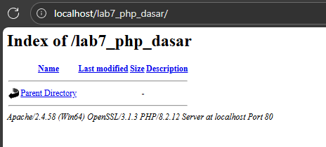

## Buat php dasar
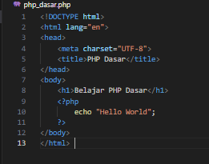

* Kemudian akses hasilnya melalui URL: http://localhost/lab7_php_dasar/php_dasar.php  

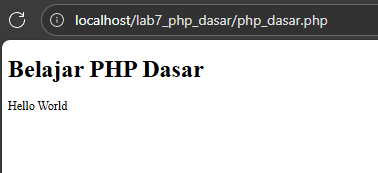

## Menambah Variable
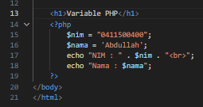    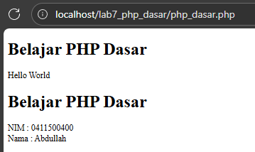

## Buat file latihan2.php
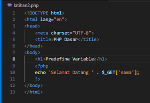    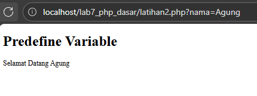

* Kemudian akses hasilnya melalui URL: http://localhost/lab7_php_dasar/latihan2.php?nama=Agung  

## Membuat Form Input 
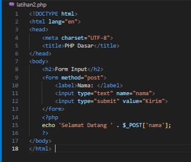    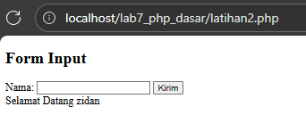

* Kemudian akses hasilnya melalui URL: http://localhost/lab7_php_dasar/latihan2.php  

### Operator
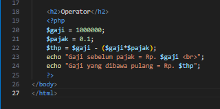    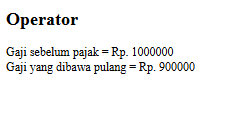

### Kondisi IF 
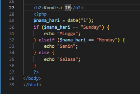    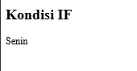

### Kondisi Switch 
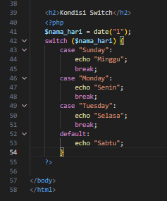   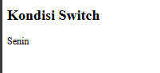

### Perulangan for
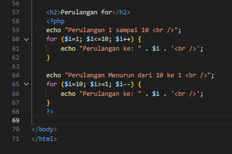   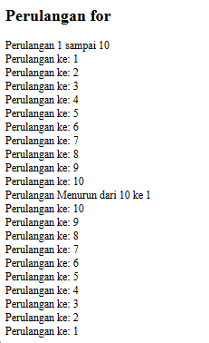

### Perulangan while
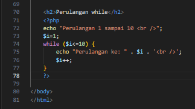   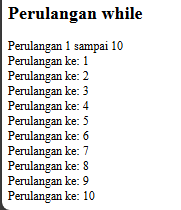

### Perulangan dowhile 
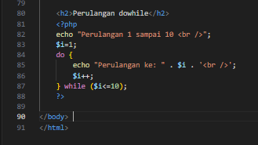   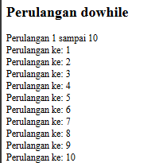

# Pertanyaan dan Tugas 
* Buatlah program PHP sederhana dengan menggunakan form input yang menampilkan 
nama, tanggal lahir dan pekerjaan. Kemudian tampilkan outputnya dengan menghitung 
umur berdasarkan inputan tanggal lahir. Dan pilihan pekerjaan dengan gaji yang 
berbeda-beda sesuai pilihan pekerjaan. 

## Jawaban Hasil
* Untuk aksesnya melalui URL: http://localhost/lab7_php_dasar/form_gaji.php

```php
<!DOCTYPE html>
<html lang="id">
<head>
    <meta charset="UTF-8">
    <title>Form Data Diri dan Gaji</title>
</head>
<body>
    <h2>Form Input Data Diri</h2>
    <form method="post" action="">
        <label>Nama:</label><br>
        <input type="text" name="nama" required><br><br>

        <label>Tanggal Lahir:</label><br>
        <input type="date" name="tgl_lahir" required><br><br>

        <label>Pekerjaan:</label><br>
        <select name="pekerjaan" required>
            <option value="">-- Pilih Pekerjaan --</option>
            <option value="Programmer">Programmer</option>
            <option value="Desainer">Desainer</option>
            <option value="Manajer">Manajer</option>
            <option value="Guru">Guru</option>
            <option value="Dokter">Dokter</option>
        </select><br><br>

        <input type="submit" value="Tampilkan">
    </form>

    <hr>

    <?php
    if ($_SERVER["REQUEST_METHOD"] == "POST") {
        $nama = $_POST['nama'];
        $tgl_lahir = $_POST['tgl_lahir'];
        $pekerjaan = $_POST['pekerjaan'];

        $lahir = new DateTime($tgl_lahir);
        $hari_ini = new DateTime();
        $umur = $hari_ini->diff($lahir)->y;

        switch ($pekerjaan) {
            case "Programmer":
                $gaji = 10000000;
                break;
            case "Desainer":
                $gaji = 8000000;
                break;
            case "Manajer":
                $gaji = 15000000;
                break;
            case "Guru":
                $gaji = 6000000;
                break;
            case "Dokter":
                $gaji = 20000000;
                break;
            default:
                $gaji = 0;
        }

        echo "<h3>Hasil Data:</h3>";
        echo "Nama: $nama <br>";
        echo "Tanggal Lahir: " . date('d-m-Y', strtotime($tgl_lahir)) . "<br>";
        echo "Umur: $umur tahun<br>";
        echo "Pekerjaan: $pekerjaan <br>";
        echo "Gaji: Rp " . number_format($gaji, 0, ',', '.') . "<br>";
    }
    ?>
</body>
</html>

```

### Tampilannya

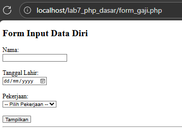

### Outputnya setelah Input

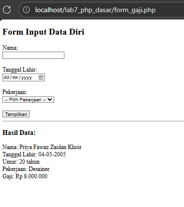