# PRATIKUM 1-10
# Praktikum 1: PHP Framework (Codeigniter)
## Mengaktifkan ekstentsi di xampp

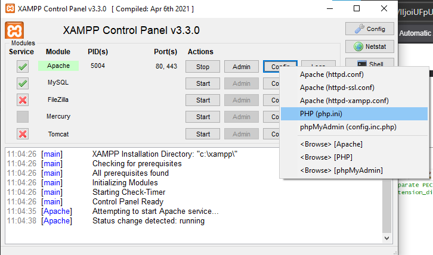

## Hapus bagian (;) untuk mengaktifkan 

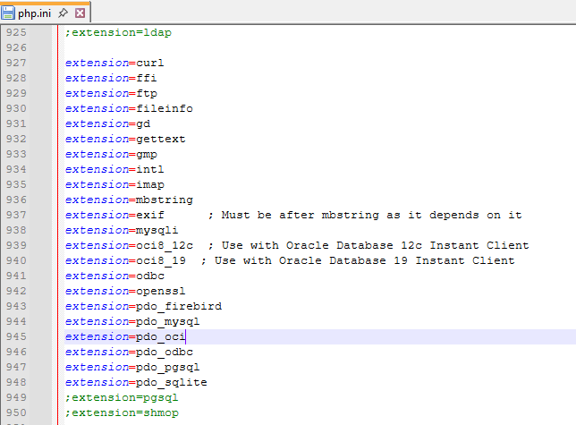

## Instalasi Codeigniter 4 dan unduh di (https://codeigniter.com/download)
## Buka browser dengan alamat http://localhost/lab11_ci/ci4/public/ sesuaikan dengan file nya.

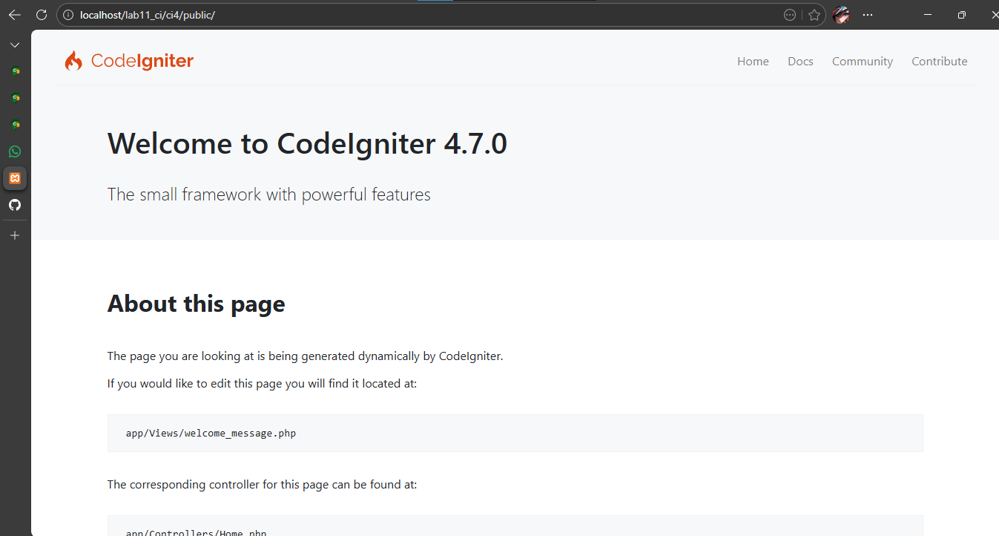

## Lalu jalankan CLI di xampp dan arahkan direktorinya (xampp/htdocs/lab11_ci/ci4/)

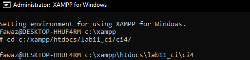

## Lalu jalankan perintah untuk memanggil CLI Codeigniter (php spark)

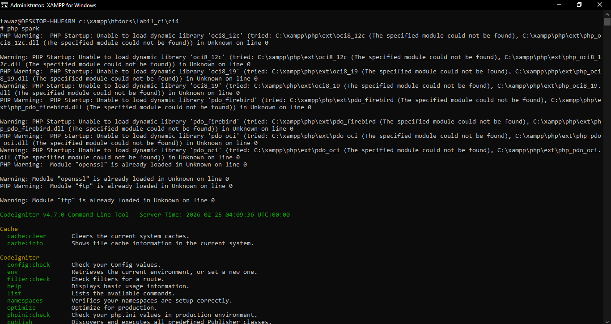

## Lalu aktifkan debugging di file env dan ubah ke (.env) dan pada bagian evironment ubah jadi development, agar menampilkan bagian yang error.

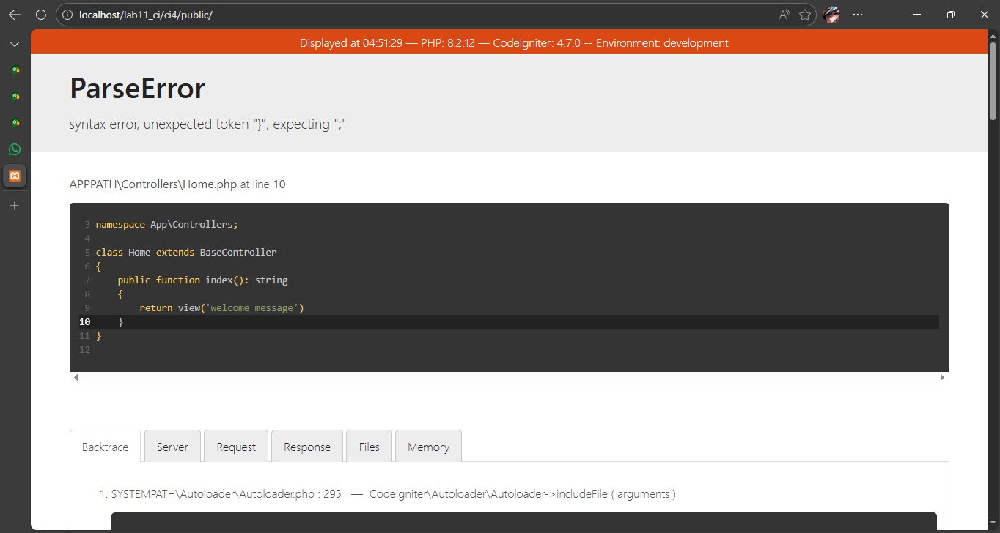

## Menambahkan route baru di (app/config/Routes.php) 

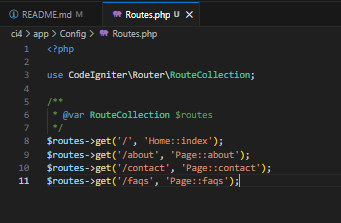

## Lalu cek route apakah sudah benar dengan jalankan perintah di Cli (php spark routes)

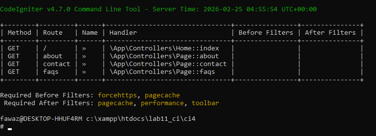

## Lalu buat file page.php di file controllers

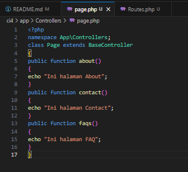

## Lalu gunakan (php spark serve) di Cli agar bisa akses (http://localhost:8080)

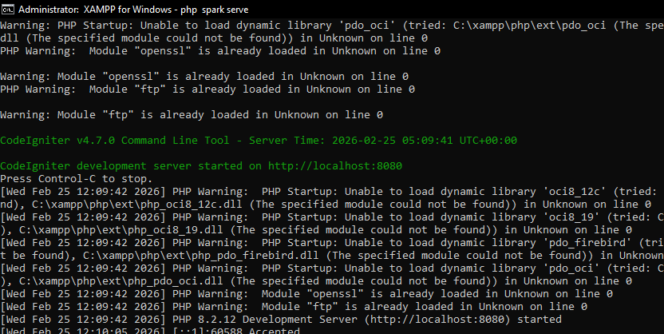

## Lalu buka http://localhost:8080/about

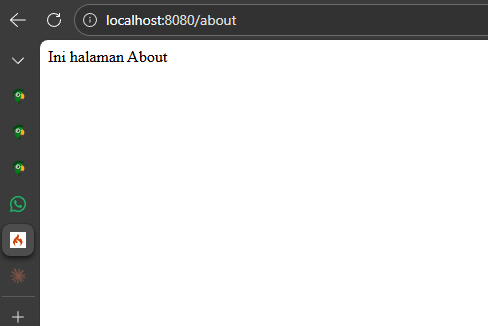

## Lalu tambahkan di controllers page
```php
public function tos()
{
echo "ini halaman Term of Services";
}
```

## Lalu buka http://localhost:8080/tos untuk cek

## Lalu membuat view atau tampilan about (app/views/about.php)
```html
di bagian views/about.php
<!DOCTYPE html>
<html lang="en">
<head>
    <meta charset="UTF-8">
    <title><?= $title; ?></title>
</head>
<body>
    <h1><?= $title; ?></h1>
    <hr>
    <p><?= $content; ?></p>
</body>
</html>
```
```php
lalu di page.php ganti dengan

public function about()
{
return view('about', [
'title' => 'Halaman Abot',
'content' => 'Ini adalah halaman abaut yang menjelaskan tentang isi
halaman ini.'
]);
}
```

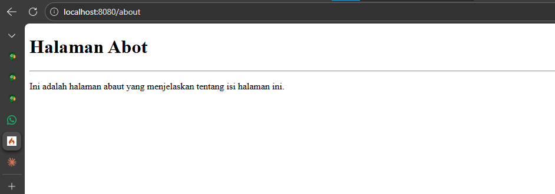

## Lalu buat file template di file Views dan tambahkan file footer dan header dan style.css di ambil di pratikum sebelumnya letakan di file Publik
```html
Header
<!DOCTYPE html>
<html lang="en">
<head>
    <meta charset="UTF-8">
    <title><?= $title; ?></title>
    <link rel="stylesheet" href="<?= base_url('/style.css');?>">
</head>
<body>
<div id="container">
<header><h1>Layout Sederhana</h1></header>
<nav>
    <a href="<?= base_url('/');?>">Home</a>
    <a href="<?= base_url('/about');?>">About</a>
    <a href="<?= base_url('/contact');?>">Kontak</a>
    <a href="<?= base_url('/faqs');?>">FAQ</a>
</nav>
<section id="wrapper">
<section id="main">
```
```html
footer
</section> <aside id="sidebar">
            <div class="widget-box">
                <h3 class="title">Widget Header</h3>
                <ul>
                    <li><a href="#">Widget Link</a></li>
                    <li><a href="#">Widget Link</a></li>
                </ul>
            </div>

            <div class="widget-box">
                <h3 class="title">Widget Text</h3>
                <p>
                    Vestibulum lorem elit, iaculis in nisl volutpat, 
                    malesuada tincidunt arcu. Proin in leo fringilla, 
                    vestibulum mi porta, faucibus felis. Integer pharetra 
                    est nunc, nec pretium nunc pretium ac.
                </p>
            </div>
        </aside>
    </section> <footer>
        <p>&copy; 2021 - Universitas Pelita Bangsa</p>
    </footer>

</div> </body>
</html>
```

## Lalu di about.php
```php
<!DOCTYPE html>
<html lang="en">
<head>
    <meta charset="UTF-8">
    <title><?= $title; ?></title>
</head>
<body>
    <?= $this->include('template/header'); ?>
    <h1><?= $title; ?></h1>
    <hr>
    <p><?= $content; ?></p>
    <?= $this->include('template/footer'); ?>
</body>
</html>
```


# Pertanyaan dan Tugas
## Lengkapi kode program untuk menu lainnya yang ada pada Controller Page, sehingga semua link pada navigasi header dapat menampilkan tampilan dengan layout yang sama.

## Kontact
```php
contact.php
<!DOCTYPE html>
<html lang="en">
<head>
    <meta charset="UTF-8">
    <title><?= $title; ?></title>
</head>
<body>
    <?= $this->include('template/header'); ?>
    <h1><?= $title; ?></h1>
    <hr>
    <p><?= $content; ?></p>
    <?= $this->include('template/footer'); ?>
</body>
</html>
```
### Dan untuk Faqs, ToS sama seperti contact.php
## Lalu di bagian page.php
```php
<?php

namespace App\Controllers;

class Page extends BaseController
{
    public function about()
    {
        return view('about', [
            'title'   => 'Halaman About',
            'content' => 'Ini adalah halaman About yang menjelaskan tentang isi halaman ini.'
        ]);
    }

    public function contact()
    {
        return view('contact', [
            'title'   => 'Halaman Contact',
            'content' => 'Ini adalah halaman Contact. Silakan hubungi kami melalui email atau nomor telepon yang tersedia.'
        ]);
    }

    public function faqs()
    {
        return view('faqs', [
            'title'   => 'Halaman FAQ',
            'content' => 'Ini adalah halaman FAQ (Frequently Asked Questions) yang berisi pertanyaan-pertanyaan yang sering diajukan.'
        ]);
    }

    public function tos()
    {
        return view('tos', [
            'title'   => 'Term of Services',
            'content' => 'Ini adalah halaman Term of Services yang berisi syarat dan ketentuan penggunaan layanan kami.'
        ]);
    }
}
```
## Tampilan sederhana kontak, faq dan Tos, sama seperti tampilan about


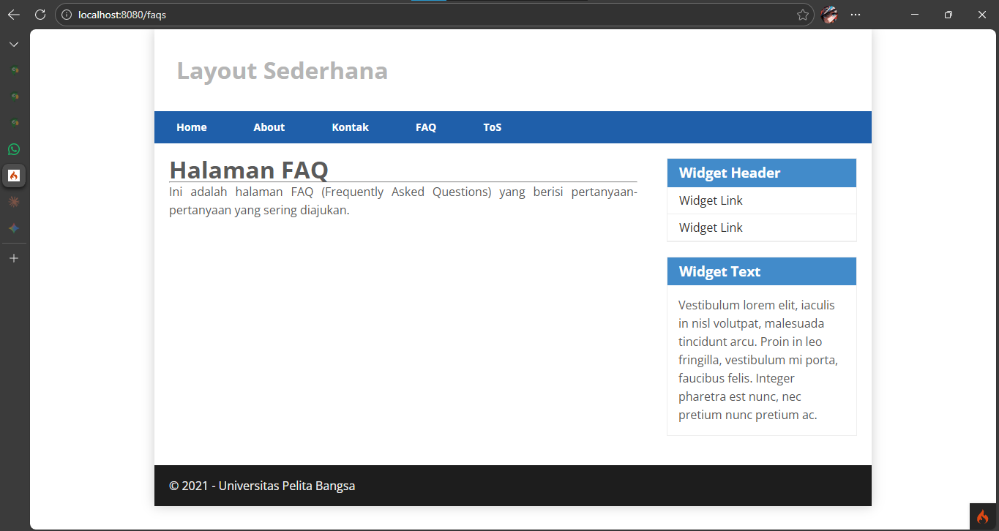

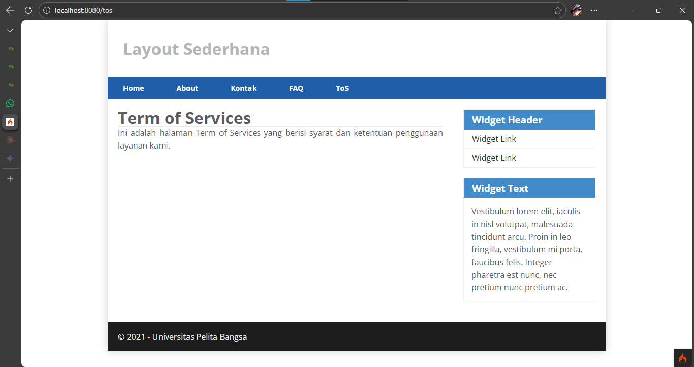

# Praktikum 2: Framework Lanjutan (CRUD)
## Membuat Database: Studi Kasus Data Artikel
### Membuat database
```sql
CREATE DATABASE lab_ci4;
```
### Membuat Tabel
```sql
CREATE TABLE artikel (
    id INT(11) auto_increment,
    judul VARCHAR(200) NOT NULL,
    isi TEXT,
    gambar VARCHAR(200),
    status TINYINT(1) DEFAULT 0,
    slug VARCHAR(200),
    PRIMARY KEY(id)
);
```
### Konfigurasi koneksi database
#### dan di .env konfigurasi
```t
#--------------------------------------------------------------------
# DATABASE
#--------------------------------------------------------------------

database.default.hostname = localhost
database.default.database = lab_ci4
database.default.username = root
database.default.password = 
database.default.DBDriver = MySQLi
database.default.DBPrefix =
database.default.port = 3306
```

### Membuat Model pada direktori app/Models dengan nama ArtikelModel.php
```php
<?php

namespace App\Models;

use CodeIgniter\Model;

class ArtikelModel extends Model
{
    protected $table            = 'artikel';
    protected $primaryKey       = 'id';
    protected $useAutoIncrement = true;

    protected $allowedFields = [
        'judul',
        'isi',
        'status',
        'slug',
        'gambar'
    ];
}
```
### Membuat Controller Artikel.php pada direktori app/Controllers.
```php
<?php

namespace App\Controllers;

use App\Models\ArtikelModel;

class Artikel extends BaseController
{
    public function index()
    {
        $title = 'Daftar Artikel';

        $model   = new ArtikelModel();
        $artikel = $model->findAll();

        return view('artikel/index', compact('artikel', 'title'));
    }
}
```
### Membuat View dan Buat direktori baru dengan nama artikel pada direktori app/views, kemudian buat file baru dengan nama index.php
```php
<?= $this->include('template/header'); ?>

<?php if ($artikel): ?>
    <?php foreach ($artikel as $row): ?>
        <article class="entry">
            <h2>
                <a href="<?= base_url('/artikel/' . $row['slug']); ?>">
                    <?= $row['judul']; ?>
                </a>
            </h2>

            " 
                alt="<?= $row['judul']; ?>"
            >

            <p>
                <?= substr($row['isi'], 0, 200); ?>
            </p>
        </article>

        <hr class="divider" />
    <?php endforeach; ?>
<?php else: ?>
    <article class="entry">
        <h2>Belum ada data.</h2>
    </article>
<?php endif; ?>

<?= $this->include('template/footer'); ?>
```
### Lalu di routes tambahka ($routes->get('/artikel', 'Artikel::index');) dan di header  (<a href="<?= base_url('/artikel'); ?>">Artikel</a> )
### Lalu di Sql tambahkan
```sql
INSERT INTO artikel (judul, isi, slug) VALUES
(
    'Artikel pertama',
    'Lorem Ipsum adalah contoh teks atau dummy dalam industri percetakan dan penataan huruf atau typesetting. Lorem Ipsum telah menjadi standar contoh teks sejak tahun 1500an, saat seorang tukang cetak yang tidak dikenal mengambil sebuah kumpulan teks dan mengacaknya untuk menjadi sebuah buku contoh huruf.',
    'artikel-pertama'
),
(
    'Artikel kedua',
    'Tidak seperti anggapan banyak orang, Lorem Ipsum bukanlah teks-teks yang diacak. Ia berakar dari sebuah naskah sastra latin klasik dari era 45 sebelum masehi, hingga bisa dipastikan usianya telah mencapai lebih dari 2000 tahun.',
    'artikel-kedua'
);
```

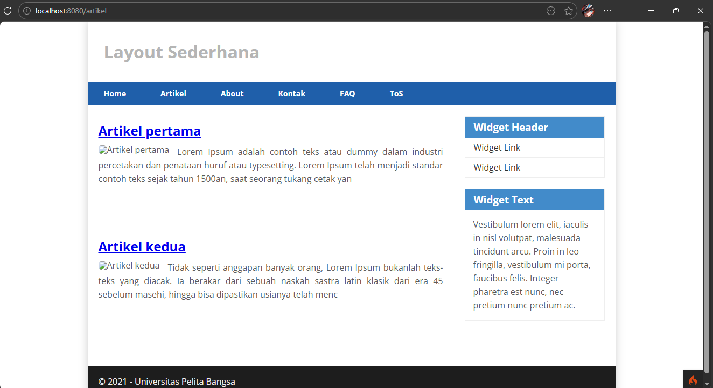

### Membuat Tampilan Detail Artikel dan Tambahkan fungsi baru pada Controller Artikel dengan nama view().
```php
public function view($slug)
{
    $model = new ArtikelModel();

    $artikel = $model->where([
        'slug' => $slug
    ])->first();

    // Menampilkan error apabila data tidak ada
    if (!$artikel) {
        throw PageNotFoundException::forPageNotFound();
    }

    $title = $artikel['judul'];

    return view('artikel/detail', compact('artikel', 'title'));
}
```

### Membuat View Detail dan Buat view baru untuk halaman detail dengan nama app/views/artikel/detail.php.
```php
<?= $this->include('template/header'); ?>

<article class="entry">
    <h2><?= $artikel['judul']; ?></h2>

    " 
        alt="<?= $artikel['judul']; ?>"
    >

    <p>
        <?= $artikel['isi']; ?>
    </p>
</article>

<?= $this->include('template/footer'); ?>
```

### Membuat Routing untuk artikel detail dan Buka Kembali file app/config/Routes.php, kemudian tambahkan routing untuk artikel detail. ($routes->get('/artikel/(:any)', 'Artikel::view/$1'))

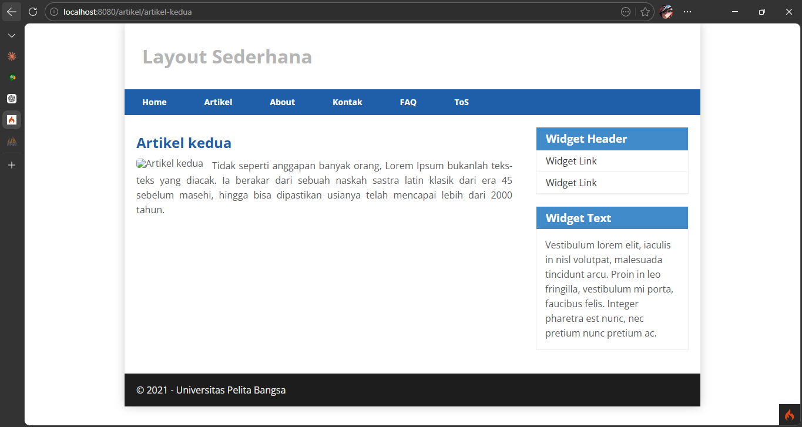

### Membuat Menu Admin. Buat method baru pada Controller Artikel dengan nama admin_index(). 
```php
public function admin_index()
{
    $title = 'Daftar Artikel';

    $model   = new ArtikelModel();
    $artikel = $model->findAll();

    return view('artikel/admin_index', compact('artikel', 'title'));
}
```
### Selanjutnya buat view untuk tampilan admin dengan nama admin_index.php
```php
<?= $this->include('template/admin_header'); ?>

<table class="table">
    <thead>
        <tr>
            <th>ID</th>
            <th>Judul</th>
            <th>Status</th>
            <th>Aksi</th>
        </tr>
    </thead>

    <tbody>
        <?php if ($artikel): ?>
            <?php foreach ($artikel as $row): ?>
                <tr>
                    <td><?= $row['id']; ?></td>

                    <td>
                        <b><?= $row['judul']; ?></b>
                        <p>
                            <small><?= substr($row['isi'], 0, 50); ?></small>
                        </p>
                    </td>

                    <td><?= $row['status']; ?></td>

                    <td>
                        <a 
                            class="btn" 
                            href="<?= base_url('/admin/artikel/edit/' . $row['id']); ?>"
                        >
                            Ubah
                        </a>

                        <a 
                            class="btn btn-danger"
                            onclick="return confirm('Yakin menghapus data?');"
                            href="<?= base_url('/admin/artikel/delete/' . $row['id']); ?>"
                        >
                            Hapus
                        </a>
                    </td>
                </tr>
            <?php endforeach; ?>
        <?php else: ?>
            <tr>
                <td colspan="4">Belum ada data.</td>
            </tr>
        <?php endif; ?>
    </tbody>

    <tfoot>
        <tr>
            <th>ID</th>
            <th>Judul</th>
            <th>Status</th>
            <th>Aksi</th>
        </tr>
    </tfoot>
</table>

<?= $this->include('template/admin_footer'); ?>
```
### Tambahkan routing untuk menu admin seperti berikut:
```php
$routes->group('admin', function ($routes) {

    $routes->get('artikel', 'Artikel::admin_index');

    $routes->add('artikel/add', 'Artikel::add');

    $routes->add('artikel/edit/(:any)', 'Artikel::edit/$1');

    $routes->get('artikel/delete/(:any)', 'Artikel::delete/$1');
});
```

### Dan sesuaikan tampilan css untuk tabel CRUD

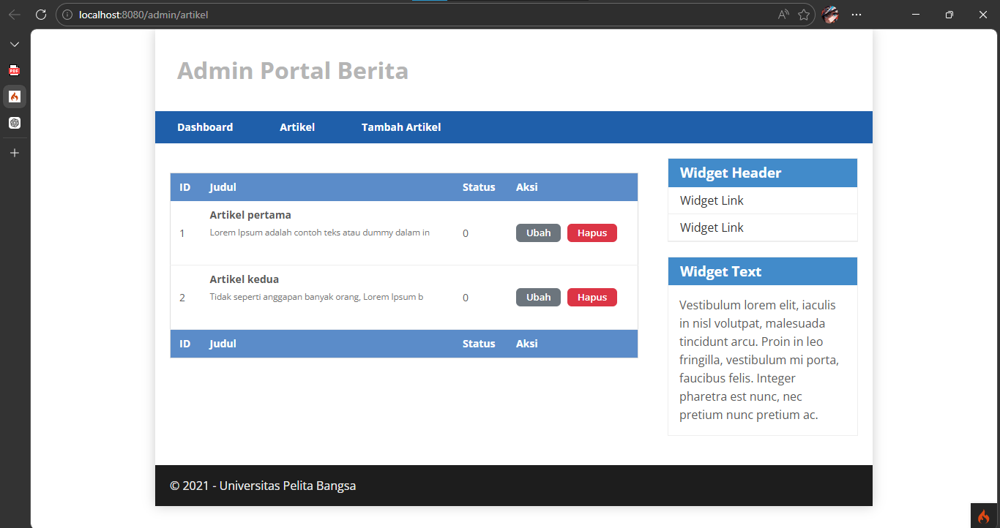

### Menambah Data Artikel Tambahkan fungsi/method baru pada Controller Artikel dengan nama add(). 
```php
public function add()
{
    // Validasi data
    $validation = \Config\Services::validation();
    $validation->setRules([
        'judul' => 'required'
    ]);

    $isDataValid = $validation
        ->withRequest($this->request)
        ->run();

    if ($isDataValid) {

        $artikel = new ArtikelModel();

        $artikel->insert([
            'judul' => $this->request->getPost('judul'),
            'isi'   => $this->request->getPost('isi'),
            'slug'  => url_title(
                $this->request->getPost('judul'),
                '-',
                true
            ),
        ]);

        return redirect()->to('/admin/artikel');
    }

    $title = "Tambah Artikel";

    return view('artikel/form_add', compact('title'));
}
```
### Kemudian buat view untuk form tambah dengan nama form_add.php
```php
<?= $this->include('template/admin_header'); ?>

<h2><?= $title; ?></h2>

<form action="" method="post">

    <p>
        <input 
            type="text" 
            name="judul" 
            placeholder="Masukkan judul artikel"
        >
    </p>

    <p>
        <textarea 
            name="isi" 
            cols="50" 
            rows="10"
            placeholder="Masukkan isi artikel"
        ></textarea>
    </p>

    <p>
        <input 
            type="submit" 
            value="Kirim" 
            class="btn btn-large"
        >
    </p>

</form>

<?= $this->include('template/admin_footer'); ?>
```

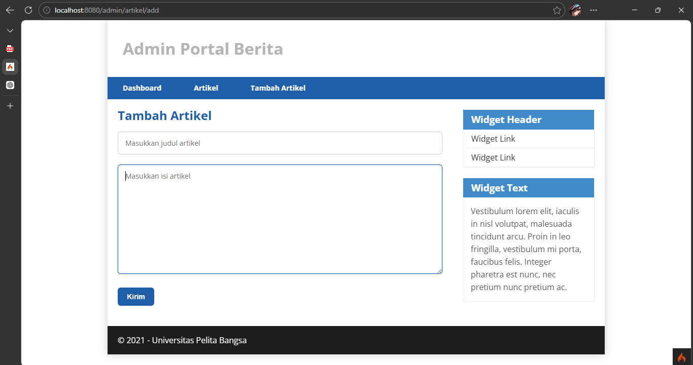

### Mengubah Data dan Tambahkan fungsi/method baru pada Controller Artikel dengan nama edit().
```php
public function edit($id)
{
    $artikel = new ArtikelModel();

    // Validasi data
    $validation = \Config\Services::validation();
    $validation->setRules([
        'judul' => 'required'
    ]);

    $isDataValid = $validation
        ->withRequest($this->request)
        ->run();

    if ($isDataValid) {

        $artikel->update($id, [
            'judul' => $this->request->getPost('judul'),
            'isi'   => $this->request->getPost('isi'),
        ]);

        return redirect()->to('/admin/artikel');
    }

    // Ambil data lama
    $data = $artikel->where('id', $id)->first();

    $title = "Edit Artikel";

    return view('artikel/form_edit', compact('title', 'data'));
}
```

### Kemudian buat view untuk form tambah dengan nama form_edit.php
```php
<?= $this->include('template/admin_header'); ?>

<h2><?= $title; ?></h2>

<form action="" method="post">

    <p>
        <input 
            type="text" 
            name="judul" 
            value="<?= $data['judul']; ?>"
        >
    </p>

    <p>
        <textarea 
            name="isi" 
            cols="50" 
            rows="10"
        ><?= $data['isi']; ?></textarea>
    </p>

    <p>
        <input 
            type="submit" 
            value="Kirim" 
            class="btn btn-large"
        >
    </p>

</form>

<?= $this->include('template/admin_footer'); ?>
```

### Menghapus Data dan Tambahkan fungsi/method baru pada Controller Artikel dengan nama delete(). 
```php
public function delete($id)  
    { 
        $artikel = new ArtikelModel(); 
        $artikel->delete($id); 
        return redirect('admin/artikel'); 
    } 
```

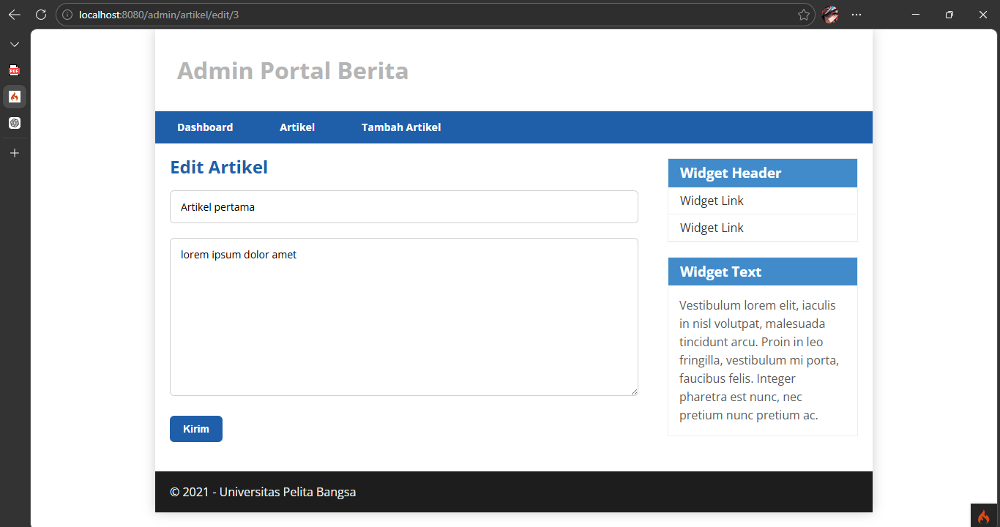

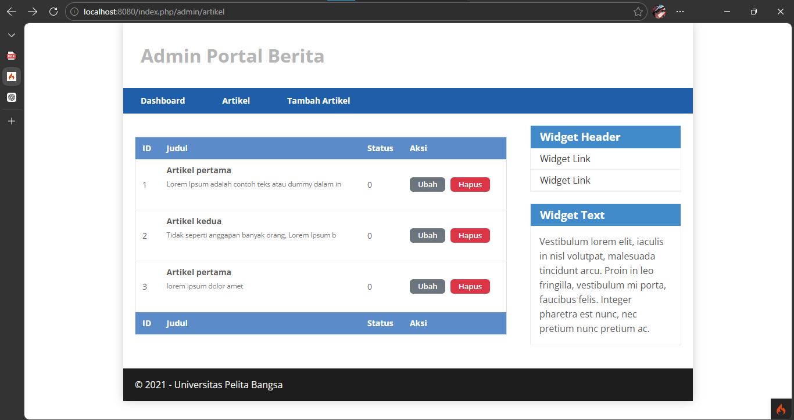

### Tambahan untuk admin_dashboard.php
```php
Route
$routes->get('/', 'Artikel::dashboard');
```
```php
untuk artikel.php
public function dashboard()
{
    $title = "Dashboard Admin";

    return view('artikel/admin_dashboard', compact('title'));
}
```
```php
Views dashboard admin_dashboard.php
<?= $this->include('template/admin_header'); ?>

<h2><?= $title; ?></h2>

<div class="dashboard-box">
    <p>Selamat datang di halaman Dashboard Admin.</p>
</div>

<?= $this->include('template/admin_footer'); ?>
```

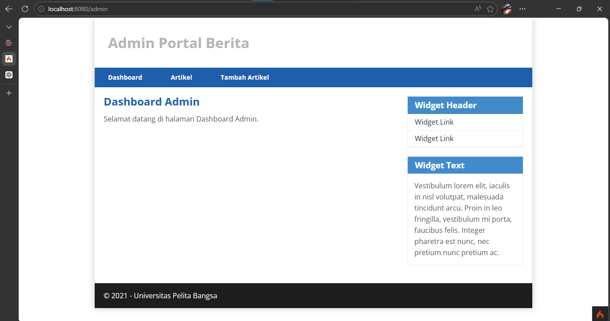

# Praktikum 3: View Layout dan View Cell
### Membuat Layout Utama Buat folder layout di dalam app/Views/, Buat file main.php di dalam folder layout 
```php
<!DOCTYPE html>
<html lang="en">
<head>
    <meta charset="UTF-8">
    <title><?= $title ?? 'My Website' ?></title>
    <link rel="stylesheet" href="<?= base_url('/style.css');?>">
</head>
<body>
<div id="container">
    <header>
        <h1>Layout Sederhana</h1>
    </header>
    <nav>
        <a href="<?= base_url('/');?>" class="active">Home</a>
        <a href="<?= base_url('/artikel');?>">Artikel</a>
        <a href="<?= base_url('/about');?>">About</a>
        <a href="<?= base_url('/contact');?>">Kontak</a>
    </nav>
    <section id="wrapper">
        <section id="main">
            <?= $this->renderSection('content') ?>
        </section>
        <aside id="sidebar">
            <?= view_cell('App\\Cells\\ArtikelTerkini::render') ?>
            <div class="widget-box">
                <h3 class="title">Widget Header</h3>
                <ul>
                    <li><a href="#">Widget Link</a></li>
                    <li><a href="#">Widget Link</a></li>
                </ul>
            </div>
            <div class="widget-box">
                <h3 class="title">Widget Text</h3>
                <p>Vestibulum lorem elit, iaculis in nisl volutpat,
                malesuada tincidunt arcu. Proin in leo fringilla,
                vestibulum mi porta, faucibus felis. Integer pharetra
                est nunc, nec pretium nunc pretium ac.</p>
            </div>
        </aside>
    </section>
    <footer>
        <p>&copy; 2021 - Universitas Pelita Bangsa</p>
    </footer>
</div>
</body>
</html>
```
### Modifikasi File View Ubah app/Views/home.php agar sesuai dengan layout baru
```php
<?= $this->extend('layout/main') ?>

<?= $this->section('content') ?>

<div class="entry">
    <h2><?= $title; ?></h2>
    <hr>
    <p><?= $content; ?></p>
</div>

<div class="entry">
    <h2>Artikel Terbaru</h2>
    <hr>
    <?php
        $model   = new App\Models\ArtikelModel();
        $artikel = $model->orderBy('created_at', 'DESC')->limit(5)->findAll();
    ?>
    <?php if ($artikel) : ?>
        <?php foreach ($artikel as $row) : ?>
            <article class="entry">
                <h3>
                    <a href="<?= base_url('/artikel/' . $row['slug']) ?>">
                        <?= $row['judul'] ?>
                    </a>
                </h3>
                <p><?= substr($row['isi'], 0, 150); ?>...</p>
                <hr class="divider">
            </article>
        <?php endforeach; ?>
    <?php else : ?>
        <p>Belum ada artikel.</p>
    <?php endif; ?>
</div>

<?= $this->endSection() ?>
```
### Tambahkan Field
```sql
ALTER TABLE artikel ADD COLUMN created_at DATETIME DEFAULT CURRENT_TIMESTAMP;
UPDATE artikel SET created_at = NOW() WHERE created_at IS NULL;
```
### Membuat Class View Cell Buat folder Cells di dalam app/ Buat file ArtikelTerkini.php di dalam app/Cells/
```php
<?php

namespace App\Cells;

use CodeIgniter\View\Cell;
use App\Models\ArtikelModel;

class ArtikelTerkini extends Cell
{
    public function render()
    {
        $model   = new ArtikelModel();
        $artikel = $model->orderBy('created_at', 'DESC')->limit(5)->findAll();

        return view('components/artikel_terkini', ['artikel' => $artikel]);
    }
}
```

### Membuat View untuk View Cell Buat folder components di dalam app/Views/ Buat file artikel_terkini.php di dalam app/Views/components/ 
```php
<div class="widget-box">
    <h3 class="title">Artikel Terkini</h3>
    <ul>
        <?php foreach ($artikel as $row) : ?>
            <li>
                <a href="<?= base_url('/artikel/' . $row['slug']) ?>">
                    <?= $row['judul'] ?>
                </a>
            </li>
        <?php endforeach; ?>
    </ul>
</div>
```
### Modifikasi ArtikelTerkini.php
```php
<?php

namespace App\Cells;

use CodeIgniter\View\Cell;
use App\Models\ArtikelModel;

class ArtikelTerkini extends Cell
{
    public function render(string $kategori = '')
    {
        $model = new ArtikelModel();

        // Jika kategori diberikan, filter berdasarkan kategori
        if (!empty($kategori)) {
            $model->where('kategori', $kategori);
        }

        $artikel = $model->orderBy('created_at', 'DESC')->limit(5)->findAll();

        return view('components/artikel_terkini', [
            'artikel'  => $artikel,
            'kategori' => $kategori,
        ]);
    }
}
```

### ganti bagian view_cell di main.php
```php
<?= view_cell('App\\Cells\\ArtikelTerkini::render', ['kategori' => 'teknologi']) ?>
```
### ganti artkel_terkini.php
```php
<div class="widget-box">
    <h3 class="title">
        Artikel Terkini 
        <?= !empty($kategori) ? '- ' . ucfirst($kategori) : '' ?>
    </h3>
    <ul>
        <?php if (!empty($artikel)) : ?>
            <?php foreach ($artikel as $row) : ?>
                <li>
                    <a href="<?= base_url('/artikel/' . $row['slug']) ?>">
                        <?= $row['judul'] ?>
                    </a>
                </li>
            <?php endforeach; ?>
        <?php else : ?>
            <li>Tidak ada artikel ditemukan.</li>
        <?php endif; ?>
    </ul>
</div>
```
### Update bagian app/Models/ArtikelModel.php
```php
<?php

namespace App\Models;

use CodeIgniter\Model;

class ArtikelModel extends Model
{
    protected $table            = 'artikel';
    protected $primaryKey       = 'id';
    protected $useAutoIncrement = true;

    // Tambahkan 'created_at' di allowedFields
    protected $allowedFields = ['judul', 'isi', 'status', 'slug', 'gambar', 'created_at'];

    // Tambahkan ini agar CI4 otomatis isi created_at & updated_at
    protected $useTimestamps = true;
    protected $createdField  = 'created_at';
    protected $updatedField  = '';
}
```
### Bagian home controllers
```php
<?php

namespace App\Controllers;

class Home extends BaseController
{
    public function index()
    {
        $title   = 'Halaman Home';
        $content = 'Selamat datang di website Portal Berita. 
                    Temukan berbagai artikel menarik di sini.';

        return view('home', compact('title', 'content'));
    }
}
```

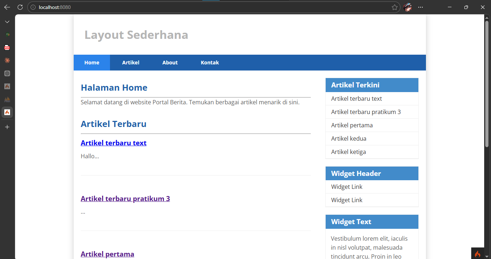

# Praktikum 4: Framework Lanjutan (Modul Login)
### Membuat Tabel: User Login 
```sql
Field Tipe Data Ukuran Keterangan 
id INT 11 PRIMARY KEY, auto_increment 
username VARCHAR 200  
useremail VARCHAR 200  
userpassword VARCHAR 200 
```

### Membuat Tabel User 
```sql
CREATE TABLE user ( 
  id INT(11) auto_increment, 
  username VARCHAR(200) NOT NULL, 
  useremail VARCHAR(200), 
  userpassword VARCHAR(200), 
  PRIMARY KEY(id) 
); 
```

### Membuat Model User untuk memproses data Login. Buat file baru pada direktori app/Models dengan nama UserModel.php
```php
<?php 
 
namespace App\Models; 
 
use CodeIgniter\Model; 
 
class UserModel extends Model 
{ 
    protected $table = 'user'; 
    protected $primaryKey = 'id'; 
    protected $useAutoIncrement = true; 
    protected $allowedFields = ['username', 'useremail', 'userpassword']; 
}
```

### Membuat Controller User.php pada direktori app/Controllers. Kemudian tambahkan method index() untuk menampilkan daftar user, dan method login() untuk proses login. 
```php
<?php 
 
namespace App\Controllers; 
 
use App\Models\UserModel; 
 
class User extends BaseController 
{ 
    public function index()  
    { 
        $title = 'Daftar User'; 
        $model = new UserModel(); 
        $users = $model->findAll(); 
        return view('user/index', compact('users', 'title')); 
    } 
 
    public function login() 
    { 
        helper(['form']); 
        $email = $this->request->getPost('email'); 
        $password = $this->request->getPost('password'); 
        if (!$email) 
        { 
            return view('user/login'); 
        } 
 
        $session = session(); 
        $model = new UserModel(); 
        $login = $model->where('useremail', $email)->first(); 
        if ($login) 
        { 
            $pass = $login['userpassword']; 
            if (password_verify($password, $pass)) 
            { 
                $login_data = [ 
                    'user_id' => $login['id'], 
                    'user_name' => $login['username'], 
                    'user_email' => $login['useremail'], 
                    'logged_in' => TRUE, 
                ]; 
                $session->set($login_data); 
                return redirect('admin/artikel'); 
            } 
            else  
            { 
                $session->setFlashdata("flash_msg", "Password salah."); 
                return redirect()->to('/user/login'); 
            } 
        } 
        else 
        { 
            $session->setFlashdata("flash_msg", "email tidak terdaftar."); 
            return redirect()->to('/user/login'); 
        } 
    } 
} 
```

### Membuat View Login dengan nama user pada direktori app/views, kemudian buat file baru dengan nama login.php. 
```php
<!DOCTYPE html>
<html lang="en">
<head>
    <meta charset="UTF-8">
    <title>Login</title>
    <link rel="stylesheet" href="<?= base_url('/style.css'); ?>">
</head>
<body>
    <div id="login-wrapper">
        <h1>Sign In</h1>

        <?php if (session()->getFlashdata('flash_msg')): ?>
            <div class="alert alert-danger">
                <?= session()->getFlashdata('flash_msg') ?>
            </div>
        <?php endif; ?>

        <form action="" method="post">
            <div class="mb-3">
                <label for="InputForEmail" class="form-label">
                    Email address
                </label>
                <input 
                    type="email" 
                    name="email" 
                    class="form-control"
                    id="InputForEmail" 
                    value="<?= set_value('email') ?>"
                >
            </div>

            <div class="mb-3">
                <label for="InputForPassword" class="form-label">
                    Password
                </label>
                <input 
                    type="password" 
                    name="password" 
                    class="form-control"
                    id="InputForPassword"
                >
            </div>

            <button type="submit" class="btn btn-primary">
                Login
            </button>
        </form>
    </div>
</body>
</html>
```

### Membuat Database Seeder (php spark make:seeder UserSeeder )

.png>)

#### buka file UserSeeder.php yang berada di lokasi direktori/app/Database/Seeds/UserSeeder.php kemudian isi dengan
```php
<?php 
 
namespace App\Database\Seeds; 
 
use CodeIgniter\Database\Seeder; 
 
class UserSeeder extends Seeder 
{ 
    public function run() 
    { 
        $model = model('UserModel'); 
        $model->insert([ 
            'username' => 'admin', 
            'useremail' => 'admin@email.com', 
            'userpassword' => password_hash('admin123', PASSWORD_DEFAULT), 
        ]); 
    } 
} 
```

### Selanjutnya buka kembali CLI dan ketik perintah berikut: (php spark db:seed UserSeeder)

.png>)

### Uji Coba Login. Selanjutnya buka url http://localhost:8080/user/login seperti berikut: 

.png>)

### Menambahkan Auth Filter untuk halaman admin. Buat file baru dengan nama Auth.php pada direktori app/Filters.
```php
<?php namespace App\Filters; 
  
use CodeIgniter\HTTP\RequestInterface; 
use CodeIgniter\HTTP\ResponseInterface; 
use CodeIgniter\Filters\FilterInterface; 
  
class Auth implements FilterInterface 
{ 
    public function before(RequestInterface $request, $arguments = null) 
    { 
        // jika user belum login 
        if(! session()->get('logged_in')){ 
            // maka redirct ke halaman login 
            return redirect()->to('/user/login'); 
        } 
    } 
  
    public function after(RequestInterface $request, ResponseInterface 
$response, $arguments = null) 
    { 
        // Do something here 
    } 
} 
```

### Selanjutnya buka file app/Config/Filters.php tambahkan kode berikut: 'auth' => App\Filters\Auth::class
```php
<?php

namespace Config;

use CodeIgniter\Config\Filters as BaseFilters;
use CodeIgniter\Filters\Cors;
use CodeIgniter\Filters\CSRF;
use CodeIgniter\Filters\DebugToolbar;
use CodeIgniter\Filters\ForceHTTPS;
use CodeIgniter\Filters\Honeypot;
use CodeIgniter\Filters\InvalidChars;
use CodeIgniter\Filters\PageCache;
use CodeIgniter\Filters\PerformanceMetrics;
use CodeIgniter\Filters\SecureHeaders;
use App\Filters\Auth; 

class Filters extends BaseFilters
{
    public array $aliases = [
        'csrf'          => CSRF::class,
        'toolbar'       => DebugToolbar::class,
        'honeypot'      => Honeypot::class,
        'invalidchars'  => InvalidChars::class,
        'secureheaders' => SecureHeaders::class,
        'cors'          => Cors::class,
        'forcehttps'    => ForceHTTPS::class,
        'pagecache'     => PageCache::class,
        'performance'   => PerformanceMetrics::class,
        'auth'          => Auth::class,
    ];

    public array $required = [
        'before' => [
            'forcehttps',
            'pagecache',
        ],
        'after' => [
            'pagecache',
            'performance',
            'toolbar',
        ],
    ];

    public array $globals = [
        'before' => [
            // 'csrf',
        ],
        'after' => [
            // 'secureheaders',
        ],
    ];

    public array $methods = [];

    public array $filters = [];
}
```

### Selanjutnya buka file app/Config/Routes.php dan sesuaikan kodenya.
```php
<?php

use CodeIgniter\Router\RouteCollection;

/**
 * @var RouteCollection $routes
 */
$routes->get('/', 'Home::index');
$routes->get('/artikel', 'Artikel::index');
$routes->get('/about', 'Page::about');
$routes->get('/contact', 'Page::contact');
$routes->get('/faqs', 'Page::faqs');
$routes->get('/tos', 'Page::tos');
$routes->get('/artikel/(:any)', 'Artikel::view/$1');

/* LOGIN */
$routes->get('/user/login', 'User::login');
$routes->post('/user/login', 'User::login');

/* ADMIN (PAKAI FILTER AUTH) */
$routes->group('admin', ['filter' => 'auth'], function ($routes) {

    $routes->get('/', 'Artikel::dashboard');

    $routes->get('artikel', 'Artikel::admin_index');

    $routes->add('artikel/add', 'Artikel::add');

    $routes->add('artikel/edit/(:any)', 'Artikel::edit/$1');

    $routes->get('artikel/delete/(:any)', 'Artikel::delete/$1');

});
```

### Percobaan Akses Menu Admin, Buka url dengan alamat http://localhost:8080/admin/artikel ketika alamat tersebut diakses  maka, akan dimuculkan halaman login. 

.png>)

### Fungsi Logout, Tambahkan method logout pada Controller User seperti berikut: 
```php
 public function logout()
    {
        session()->destroy();
        return redirect()->to('/user/login');
    }
```

### tambahkan rute logout ($routes->get('/user/logout', 'User::logout');) dan header untuk logout khusus admin
```php
<!DOCTYPE html>
<html lang="en">
<head>
    <meta charset="UTF-8">
    <title><?= $title; ?></title>
    <link rel="stylesheet" href="<?= base_url('/style.css');?>">
</head>
<body>
<div id="container">

<header>
    <h1>Admin Portal Berita</h1>
</header>

<nav>
    <a href="<?= base_url('/admin'); ?>">Dashboard</a>
    <a href="<?= base_url('/admin/artikel'); ?>">Artikel</a>
    <a href="<?= base_url('/admin/artikel/add'); ?>">Tambah Artikel</a>

    <!-- LOGIN INFO -->
    <?php if (session()->get('logged_in')): ?>
        <span style="color:#fff; margin-left:20px;">
            Admin: <?= session()->get('user_name'); ?>
        </span>
        <a href="<?= base_url('/user/logout'); ?>" style="float:right;">
            Logout
        </a>
    <?php endif; ?>
</nav>

<section id="wrapper">
<section id="main">
```
### Untuk login dengan seeder
```
Email: admin@email.com
Password: admin123
```

# Praktikum 5: Pagination dan Pencarian 
### Membuat Pagination 
#### buka Kembali Controller Artikel, kemudian modifikasi kode pada method admin_index seperti berikut.
```php
public function admin_index()
{
    $title = 'Daftar Artikel';
    $model = new ArtikelModel();
    $data = [
        'title'   => $title,
        'artikel' => $model->paginate(10), #data dibatasi 10 record per halaman
        'pager'   => $model->pager,
    ];
    
    return view('artikel/admin_index', $data);
}
```

#### Kemudian buka file views/artikel/admin_index.php dan tambahkan kode berikut dibawah deklarasi tabel data.
```php
<?= $pager->links(); ?>
```

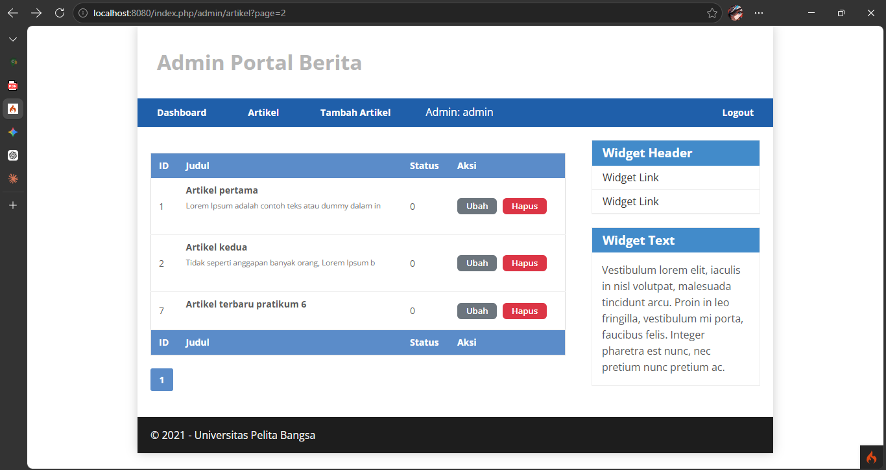

### Membuat Pencarian 
#### Untuk membuat pencarian data, buka kembali Controller Artikel, pada method admin_index ubah kodenya seperti berikut 
```php
public function admin_index()
{
    $title = 'Daftar Artikel';
    $q     = $this->request->getVar('q') ?? '';
    $model = new ArtikelModel();
    $data = [
        'title'   => $title,
        'q'       => $q,
        'artikel' => $model->like('judul', $q)->paginate(10), # data dibatasi 10 record per halaman
        'pager'   => $model->pager,
    ];
    
    return view('artikel/admin_index', $data);
}
```
#### Kemudian buka kembali file views/artikel/admin_index.php dan tambahkan form pencarian sebelum deklarasi tabel seperti berikut: 
```php
<form method="get" class="form-search">
    <input type="text" name="q" value="<?= $q; ?>" placeholder="Cari data">
    <input type="submit" value="Cari" class="btn btn-primary">
</form>
```
#### Dan pada link pager ubah seperti berikut.
```php
<?= $pager->only(['q'])->links(); ?>
```

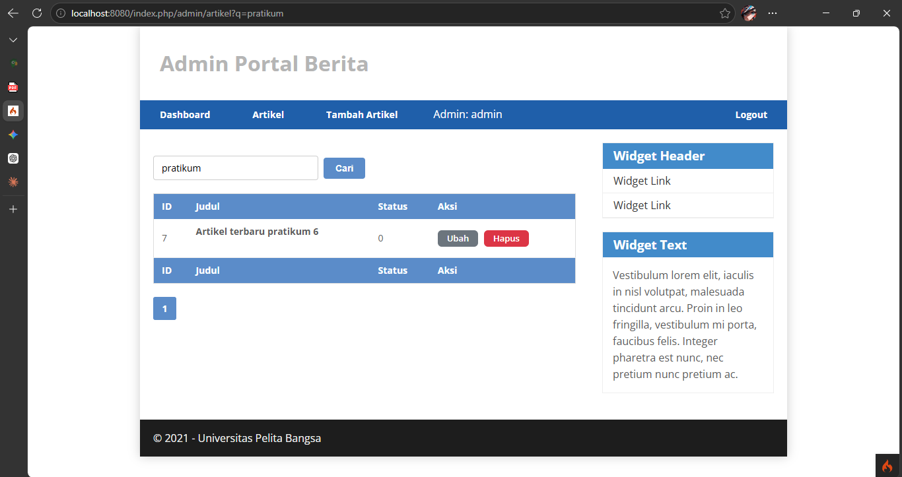

# Praktikum 6: Relasi Tabel dan Query Builder
##  membuat tabel baru bernama `kategori` untuk mengkategorikan artikel.
```sql
CREATE TABLE kategori ( 
    id_kategori INT(11) AUTO_INCREMENT, 
    nama_kategori VARCHAR(100) NOT NULL, 
    slug_kategori VARCHAR(100), 
    PRIMARY KEY (id_kategori) 
);
```
## Mengubah Tabel Artikel Tambahkan foreign key `id_kategori` pada tabel `artikel` untuk membuat relasi dengan tabel `kategori`.  
```sql
ALTER TABLE artikel 
ADD COLUMN id_kategori INT(11), 
ADD CONSTRAINT fk_kategori_artikel 
FOREIGN KEY (id_kategori) REFERENCES kategori(id_kategori); 
```

## Membuat Model Kategori Buat file model baru di `app/Models` dengan nama `KategoriModel.php`: 
```php
<?php 
 
namespace App\Models; 
 
use CodeIgniter\Model; 
 
class KategoriModel extends Model 
{ 
    protected $table = 'kategori'; 
    protected $primaryKey = 'id_kategori'; 
    protected $useAutoIncrement = true; 
    protected $allowedFields = ['nama_kategori', 'slug_kategori']; 
}
```

## Memodifikasi Model Artikel `ArtikelModel.php` untuk mendefinisikan relasi dengan `KategoriModel`: 
```php
<?php
namespace App\Models;
use CodeIgniter\Model;

class ArtikelModel extends Model
{
    protected $table            = 'artikel';
    protected $primaryKey       = 'id';
    protected $useAutoIncrement = true;

    // Tambahkan 'id_kategori' agar bisa disimpan ke database
    protected $allowedFields = ['judul', 'isi', 'status', 'slug', 'gambar', 'created_at', 'id_kategori'];

    protected $useTimestamps = true;
    protected $createdField  = 'created_at';
    protected $updatedField  = '';
}
```

## Memodifikasi Controller Artikel `Artikel.php` untuk menggunakan model baru dan menampilkan data relasi:
```php
<?php

namespace App\Controllers;

use App\Models\ArtikelModel;
use App\Models\KategoriModel; // Panggil KategoriModel
use CodeIgniter\Exceptions\PageNotFoundException;

class Artikel extends BaseController
{
    public function index()
    {
        $title = 'Daftar Artikel';
        $model = new ArtikelModel();
        
        // Join tabel kategori agar nama_kategori bisa tampil di halaman depan
        $artikel = $model->select('artikel.*, kategori.nama_kategori')
                         ->join('kategori', 'kategori.id_kategori = artikel.id_kategori', 'left')
                         ->findAll();

        return view('artikel/index', compact('artikel', 'title'));
    }

    public function view($slug)
    {
        $model = new ArtikelModel();
        $artikel = $model->select('artikel.*, kategori.nama_kategori')
                         ->join('kategori', 'kategori.id_kategori = artikel.id_kategori', 'left')
                         ->where(['slug' => $slug])
                         ->first();

        if (!$artikel) {
            throw PageNotFoundException::forPageNotFound();
        }

        $title = $artikel['judul'];
        return view('artikel/detail', compact('artikel', 'title'));
    }

    public function admin_index()
    {
        $title = 'Daftar Artikel';
        $q = $this->request->getVar('q') ?? '';
        $kategori_id = $this->request->getVar('kategori_id') ?? ''; // Ambil parameter filter kategori

        $model = new ArtikelModel();
        $kategoriModel = new KategoriModel();

        // Query Builder untuk Join
        $builder = $model->select('artikel.*, kategori.nama_kategori')
                         ->join('kategori', 'kategori.id_kategori = artikel.id_kategori', 'left');

        // Pencarian judul
        if ($q) {
            $builder->like('artikel.judul', $q);
        }
        
        // Filter kategori
        if ($kategori_id) {
            $builder->where('artikel.id_kategori', $kategori_id);
        }

        $data = [
            'title'       => $title,
            'q'           => $q,
            'kategori_id' => $kategori_id,
            'kategori'    => $kategoriModel->findAll(), // Kirim data kategori untuk dropdown filter
            'artikel'     => $builder->paginate(10),
            'pager'       => $model->pager,
        ];
        
        return view('artikel/admin_index', $data);
    }

    public function dashboard()
    {
        $title   = "Dashboard Admin";
        $model   = new ArtikelModel();
        $artikel = $model->findAll();
        return view('artikel/admin_dashboard', compact('title', 'artikel'));
    }

    public function add()
    {
        $validation = \Config\Services::validation();
        $validation->setRules([
            'judul'       => 'required',
            'id_kategori' => 'required' // Wajib pilih kategori
        ]);

        $isDataValid = $validation->withRequest($this->request)->run();

        if ($isDataValid) {
            $artikel = new ArtikelModel();
            $artikel->insert([
                'judul'       => $this->request->getPost('judul'),
                'isi'         => $this->request->getPost('isi'),
                'id_kategori' => $this->request->getPost('id_kategori'), // Simpan id_kategori
                'slug'        => url_title($this->request->getPost('judul'), '-', true),
            ]);
            return redirect()->to('/admin/artikel');
        }

        $kategoriModel = new KategoriModel();
        $title = "Tambah Artikel";
        $kategori = $kategoriModel->findAll(); // Ambil list kategori

        return view('artikel/form_add', compact('title', 'kategori'));
    }

    public function edit($id)
    {
        $artikel = new ArtikelModel();
        $kategoriModel = new KategoriModel();

        $validation = \Config\Services::validation();
        $validation->setRules([
            'judul'       => 'required',
            'id_kategori' => 'required'
        ]);

        $isDataValid = $validation->withRequest($this->request)->run();

        if ($isDataValid) {
            $artikel->update($id, [
                'judul'       => $this->request->getPost('judul'),
                'isi'         => $this->request->getPost('isi'),
                'id_kategori' => $this->request->getPost('id_kategori'), // Update id_kategori
            ]);
            return redirect()->to('/admin/artikel');
        }

        $data = $artikel->where('id', $id)->first();
        $kategori = $kategoriModel->findAll();
        $title = "Edit Artikel";

        return view('artikel/form_edit', compact('title', 'data', 'kategori'));
    }

    public function delete($id)  
    { 
        $artikel = new ArtikelModel(); 
        $artikel->delete($id); 
        return redirect()->to('/admin/artikel'); 
    } 
}
```

##  Memodifikasi View Buka folder view/artikel sesuaikan masing-masing view. index.php 
```php
<?= $this->include('template/header'); ?>

<?php if ($artikel): ?>
    <?php foreach ($artikel as $row): ?>
        <article class="entry">
            <h2>
                <a href="<?= base_url('/artikel/' . $row['slug']); ?>">
                    <?= $row['judul']; ?>
                </a>
            </h2>

            <p style="font-weight:bold; color:#1f5faa;">
                Kategori: <?= $row['nama_kategori'] ?? 'Uncategorized'; ?>
            </p>

            " alt="<?= $row['judul']; ?>">

            <p>
                <?= substr($row['isi'], 0, 200); ?>...
            </p>
        </article>
        <hr class="divider" />
    <?php endforeach; ?>
<?php else: ?>
    <article class="entry">
        <h2>Belum ada data.</h2>
    </article>
<?php endif; ?>

<?= $this->include('template/footer'); ?>
```

### admin_index.php
```php
<?= $this->include('template/admin_header'); ?>

<form method="get" class="form-search">
    <div class="search-row">
        <input type="text" name="q" value="<?= $q; ?>" placeholder="Cari judul artikel...">
        <input type="submit" value="Cari" class="btn btn-primary">
    </div>
    
    <select name="kategori_id" class="kategori-filter">
        <option value="">-- Semua Kategori --</option>
        <?php foreach ($kategori as $k): ?>
            <option value="<?= $k['id_kategori']; ?>" <?= ($kategori_id == $k['id_kategori']) ? 'selected' : ''; ?>>
                <?= $k['nama_kategori']; ?>
            </option>
        <?php endforeach; ?>
    </select>
</form>

<table class="table">
    <thead>
        <tr>
            <th>ID</th>
            <th>Judul</th>
            <th>Kategori</th> <th>Status</th>
            <th>Aksi</th>
        </tr>
    </thead>

    <tbody>
        <?php if ($artikel): ?>
            <?php foreach ($artikel as $row): ?>
                <tr>
                    <td><?= $row['id']; ?></td>

                    <td>
                        <b><?= $row['judul']; ?></b>
                        <p>
                            <small><?= substr($row['isi'], 0, 50); ?></small>
                        </p>
                    </td>

                    <td><?= $row['nama_kategori'] ?? '-'; ?></td> <td><?= $row['status']; ?></td>

                    <td>
                        <a class="btn" href="<?= base_url('/admin/artikel/edit/' . $row['id']); ?>">Ubah</a>
                        <a class="btn btn-danger" onclick="return confirm('Yakin menghapus data?');" href="<?= base_url('/admin/artikel/delete/' . $row['id']); ?>">Hapus</a>
                    </td>
                </tr>
            <?php endforeach; ?>
        <?php else: ?>
            <tr>
                <td colspan="5">Belum ada data.</td> </tr>
        <?php endif; ?>
    </tbody>
    
    <tfoot>
        <tr>
            <th>ID</th>
            <th>Judul</th>
            <th>Kategori</th>
            <th>Status</th>
            <th>Aksi</th>
        </tr>
    </tfoot>
</table>

<?= $pager->only(['q', 'kategori_id'])->links(); ?>

<?= $this->include('template/admin_footer'); ?>
```

### form_add.php
```php
<?= $this->include('template/admin_header'); ?>

<h2><?= $title; ?></h2>

<form action="" method="post">
    <p>
        <input type="text" name="judul" placeholder="Masukkan judul artikel" required>
    </p>

    <p>
        <select name="id_kategori" required>
            <option value="" disabled selected>-- Pilih Kategori --</option>
            <?php foreach($kategori as $k): ?>
                <option value="<?= $k['id_kategori']; ?>"><?= $k['nama_kategori']; ?></option>
            <?php endforeach; ?>
        </select>
    </p>

    <p>
        <textarea name="isi" cols="50" rows="10" placeholder="Masukkan isi artikel" required></textarea>
    </p>

    <p>
        <input type="submit" value="Kirim" class="btn btn-large">
    </p>
</form>

<?= $this->include('template/admin_footer'); ?>
```

### form_edit.php
```php
<?= $this->include('template/admin_header'); ?>

<h2><?= $title; ?></h2>

<form action="" method="post">
    <p>
        <input type="text" name="judul" value="<?= $data['judul']; ?>" required>
    </p>

    <p>
        <select name="id_kategori" required>
            <option value="" disabled>-- Pilih Kategori --</option>
            <?php foreach($kategori as $k): ?>
                <option value="<?= $k['id_kategori']; ?>" <?= ($data['id_kategori'] == $k['id_kategori']) ? 'selected' : ''; ?>>
                    <?= $k['nama_kategori']; ?>
                </option>
            <?php endforeach; ?>
        </select>
    </p>

    <p>
        <textarea name="isi" cols="50" rows="10" required><?= $data['isi']; ?></textarea>
    </p>

    <p>
        <input type="submit" value="Kirim" class="btn btn-large">
    </p>
</form>

<?= $this->include('template/admin_footer'); ?>
```


## Pertanyaan dan Tugas 
1. Selesaikan semua langkah praktikum di atas. 
2. Modifikasi tampilan detail artikel (artikel/detail.php) untuk menampilkan nama kategori artikel. 
3. Tambahkan fitur untuk menampilkan daftar kategori di halaman depan (opsional). 
4. Buat fungsi untuk menampilkan artikel berdasarkan kategori tertentu (opsional). 

### poin 2 edit detail.php
```php
<?= $this->include('template/header'); ?>

<article class="entry">
    <h2><?= $artikel['judul']; ?></h2>

    <p style="font-weight:600; color:#1f5faa; margin-bottom: 15px; font-size: 14px;">
        Kategori: <?= $artikel['nama_kategori'] ?? 'Tidak ada kategori'; ?>
    </p>

    " 
        alt="<?= $artikel['judul']; ?>"
        style="max-width: 100%; height: auto; margin-bottom: 15px;"
    >

    <p style="text-align: justify; line-height: 1.8;">
        <?= $artikel['isi']; ?>
    </p>
</article>

<?= $this->include('template/footer'); ?>
```

### poin 3 dan 4 edit artikel.php
```php
// Pastikan use App\Models\KategoriModel; sudah ada di bagian atas file

public function index()
{
    $title = 'Daftar Artikel';
    $model = new ArtikelModel();
    $kategoriModel = new KategoriModel(); // Tambahkan ini

    // Ambil artikel beserta nama kategorinya
    $artikel = $model->select('artikel.*, kategori.nama_kategori')
                     ->join('kategori', 'kategori.id_kategori = artikel.id_kategori', 'left')
                     ->findAll();
                     
    // Ambil semua data kategori untuk ditampilkan di sidebar halaman depan
    $kategori = $kategoriModel->findAll();

    return view('artikel/index', compact('artikel', 'title', 'kategori'));
}

// ==========================================
// TUGAS 4: Fungsi filter berdasarkan kategori
// ==========================================
public function kategori($id_kategori)
{
    $model = new ArtikelModel();
    $kategoriModel = new KategoriModel();
    
    // Cek apakah kategori ada
    $kat = $kategoriModel->find($id_kategori);
    if (!$kat) {
        throw \CodeIgniter\Exceptions\PageNotFoundException::forPageNotFound();
    }

    $title = 'Kategori: ' . $kat['nama_kategori'];
    
    // Ambil artikel hanya yang memiliki id_kategori yang dipilih
    $artikel = $model->select('artikel.*, kategori.nama_kategori')
                     ->join('kategori', 'kategori.id_kategori = artikel.id_kategori', 'left')
                     ->where('artikel.id_kategori', $id_kategori)
                     ->findAll();
                     
    // Tetap ambil semua kategori untuk menu sidebar
    $kategori = $kategoriModel->findAll();

    return view('artikel/index', compact('artikel', 'title', 'kategori'));
}
```

### poin 5 Update index.php
```php
<?= $this->include('template/header'); ?>

<div id="wrapper" class="row">
    
    <div id="main">
        <h2 style="color: #1f5faa; margin-bottom: 20px;"><?= $title ?? 'Daftar Artikel'; ?></h2>
        
        <?php if ($artikel): ?>
            <?php foreach ($artikel as $row): ?>
                <article class="entry">
                    <h2>
                        <a href="<?= base_url('/artikel/view/' . $row['slug']); ?>" style="text-decoration:none; color:#333;">
                            <?= $row['judul']; ?>
                        </a>
                    </h2>

                    <p style="font-size: 13px; font-weight:bold; color:#1f5faa; margin-top:-10px; margin-bottom:15px;">
                        Kategori: <?= $row['nama_kategori'] ?? 'Uncategorized'; ?>
                    </p>

                    " 
                        alt="<?= $row['judul']; ?>"
                    >

                    <p>
                        <?= substr($row['isi'], 0, 200); ?>...
                    </p>
                </article>

                <hr class="divider" />
            <?php endforeach; ?>
        <?php else: ?>
            <article class="entry">
                <h2>Belum ada data artikel di kategori ini.</h2>
            </article>
        <?php endif; ?>
    </div>

    <div id="sidebar">
        <div class="widget-box">
            <h3 class="title">Kategori Artikel</h3>
            <ul>
                <li><a href="<?= base_url('/artikel'); ?>">Semua Kategori</a></li>
                
                <?php if(isset($kategori)): ?>
                    <?php foreach($kategori as $k): ?>
                        <li>
                            <a href="<?= base_url('/artikel/kategori/' . $k['id_kategori']); ?>">
                                <?= $k['nama_kategori']; ?>
                            </a>
                        </li>
                    <?php endforeach; ?>
                <?php endif; ?>
            </ul>
        </div>
    </div>

</div>

<?= $this->include('template/footer'); ?>
```

### Update routes.php
```php
<?php

use CodeIgniter\Router\RouteCollection;

/**
 * @var RouteCollection $routes
 */
$routes->get('/', 'Home::index');
$routes->get('/artikel', 'Artikel::index');
$routes->get('/about', 'Page::about');
$routes->get('/contact', 'Page::contact');
$routes->get('/faqs', 'Page::faqs');
$routes->get('/tos', 'Page::tos');

// TAMBAHKAN RUTE INI UNTUK TUGAS 4 (Posisinya WAJIB di atas view artikel)
$routes->get('/artikel/kategori/(:any)', 'Artikel::kategori/$1');

// Rute ini tetap di bawahnya
$routes->get('/artikel/(:any)', 'Artikel::view/$1');

/* LOGIN */
$routes->get('/user/login', 'User::login');
$routes->post('/user/login', 'User::login');
$routes->get('/user/logout', 'User::logout');

/* ADMIN (PAKAI FILTER AUTH) */
$routes->group('admin', ['filter' => 'auth'], function ($routes) {
    $routes->get('/', 'Artikel::dashboard');
    $routes->get('artikel', 'Artikel::admin_index');
    $routes->add('artikel/add', 'Artikel::add');
    $routes->add('artikel/edit/(:any)', 'Artikel::edit/$1');
    $routes->get('artikel/delete/(:any)', 'Artikel::delete/$1');
});
```

### tambahkan seeder untuk kategori
#### php spark make:seeder KategoriSeeder
#### Buka file yang baru saja terbuat di app/Database/Seeds/KategoriSeeder.php, lalu ubah isinya menjadi seperti ini:
```php
<?php

namespace App\Database\Seeds;

use CodeIgniter\Database\Seeder;

class KategoriSeeder extends Seeder
{
    public function run()
    {
        // Data yang akan diinput (mirip dengan query SQL Anda)
        $data = [
            [
                'nama_kategori' => 'Teknologi',
                'slug_kategori' => 'teknologi'
            ],
            [
                'nama_kategori' => 'Pendidikan',
                'slug_kategori' => 'pendidikan'
            ],
            [
                'nama_kategori' => 'Gaya Hidup',
                'slug_kategori' => 'gaya-hidup'
            ],
            [
                'nama_kategori' => 'Kesehatan',
                'slug_kategori' => 'kesehatan'
            ],
            [
                'nama_kategori' => 'Hiburan',
                'slug_kategori' => 'hiburan'
            ]
        ];

        // Memasukkan semua data sekaligus ke tabel 'kategori'
        $this->db->table('kategori')->insertBatch($data);
    }
}
```

#### Lalu jalankan php spark db:seed KategoriSeeder

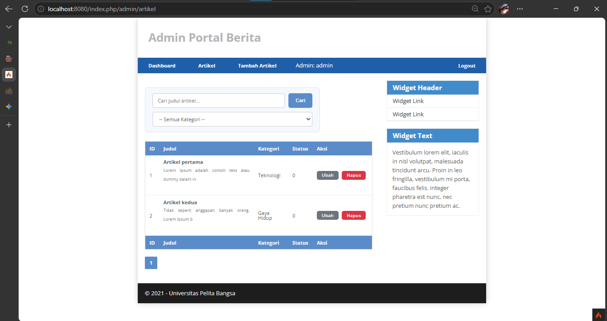

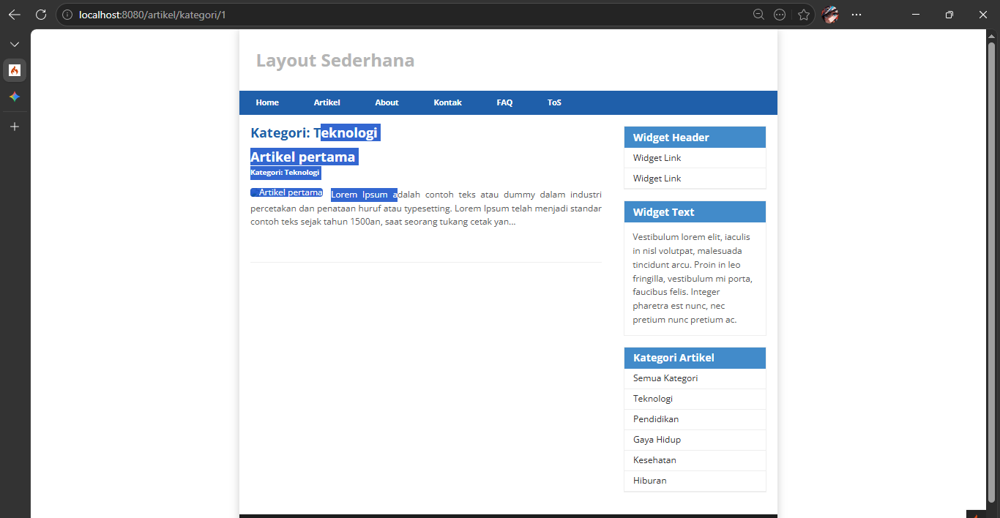

# Praktikum 6: Upload File Gambar
## Buka kembali Controller Artikel pada project sebelumnya, sesuaikan kode pada method add seperti berikut:
```php
 public function add()  
    { 
        // validasi data. 
        $validation =  \Config\Services::validation(); 
        $validation->setRules(['judul' => 'required']); 
        $isDataValid = $validation->withRequest($this->request)->run(); 
 
        if ($isDataValid) 
        { 
            $file = $this->request->getFile('gambar'); 
            $file->move(ROOTPATH . 'public/gambar'); 
 
            $artikel = new ArtikelModel(); 
            $artikel->insert([ 
                'judul'  => $this->request->getPost('judul'), 
                'isi'    => $this->request->getPost('isi'), 
                'slug'   => url_title($this->request->getPost('judul')), 
                'gambar' => $file->getName(), 
            ]); 
            return redirect('admin/artikel'); 
        } 
        $title = "Tambah Artikel"; 
        return view('artikel/form_add', compact('title')); 
    }
```

### Kemudian pada file views/artikel/form_add.php tambahkan field input file seperti berikut.
```php
<p>
        <label for="gambar">Upload Gambar:</label><br>
        <input type="file" name="gambar" id="gambar" accept="image/*">
    </p>

dan

<form action="" method="post" enctype="multipart/form-data"> 
```

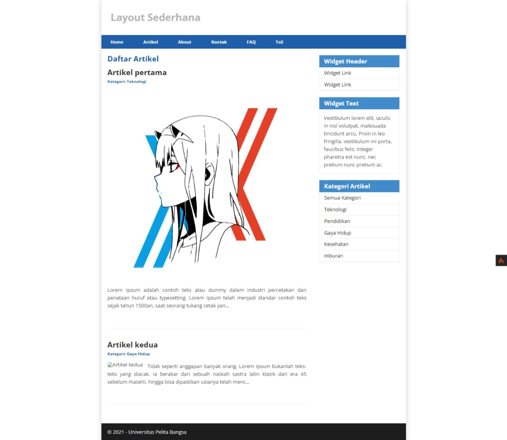

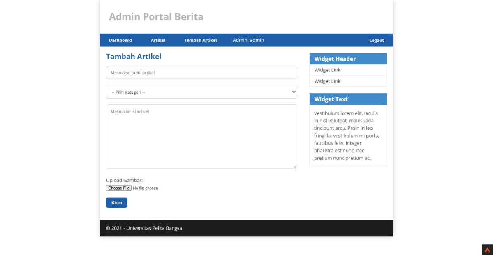

# Praktikum 8: AJAX
## Menambahkan Pustaka jQuery.
### Download pustaka jQuery versi terbaru dari https://jquery.com dan ekstrak filenya.Salin file jquery-3.6.0.min.js ke folder public/assets/js. 

## Membuat AJAX Controller
### Membuat AJAX Controller
```php
<?php

namespace App\Controllers;

use CodeIgniter\Controller;
use CodeIgniter\HTTP\Request;
use CodeIgniter\HTTP\Response;
use App\Models\ArtikelModel;

class AjaxController extends Controller
{
    public function index()
    {
        return view('ajax/index');
    }

    public function getData()
    {
        $model = new ArtikelModel();
        $data  = $model->findAll();

        // Kirim data dalam format JSON
        return $this->response->setJSON($data);
    }

    public function getById($id)
    {
        $model = new ArtikelModel();
        $data  = $model->find($id);

        return $this->response->setJSON($data);
    }

    public function save()
    {
        $model  = new ArtikelModel();
        $judul  = $this->request->getPost('judul');
        $isi    = $this->request->getPost('isi');

        $model->save([
            'judul' => $judul,
            'isi'   => $isi,
        ]);

        return $this->response->setJSON(['status' => 'OK', 'message' => 'Data berhasil ditambahkan']);
    }

    public function update($id)
    {
        $model = new ArtikelModel();
        $judul = $this->request->getPost('judul');
        $isi   = $this->request->getPost('isi');

        $model->update($id, [
            'judul' => $judul,
            'isi'   => $isi,
        ]);

        return $this->response->setJSON(['status' => 'OK', 'message' => 'Data berhasil diubah']);
    }

    public function delete($id)
    {
        $model = new ArtikelModel();
        $model->delete($id);

        $data = ['status' => 'OK'];

        // Kirim data dalam format JSON
        return $this->response->setJSON($data);
    }
}
```

### Membuat View
```php
<?= $this->include('template/header'); ?>

<!-- Modal Tambah / Ubah Artikel -->
<div id="modalOverlay" style="display:none;">
    <div id="modalBox">
        <h2 id="modalTitle">Tambah Artikel</h2>
        <input type="hidden" id="editId" value="">

        <label for="inputJudul">Judul</label>
        <input type="text" id="inputJudul" placeholder="Masukkan judul artikel">

        <label for="inputIsi">Isi</label>
        <textarea id="inputIsi" placeholder="Masukkan isi artikel" rows="4"></textarea>

        <div class="modal-buttons">
            <button id="btnSimpan">Simpan</button>
            <button id="btnBatal">Batal</button>
        </div>
    </div>
</div>

<div class="page-wrapper">
    <div class="page-header">
        <h1>Data Artikel</h1>
        <button id="btnTambah" class="btn btn-success">+ Tambah Artikel</button>
    </div>

    <table class="table-data" id="artikelTable">
        <thead>
            <tr>
                <th>ID</th>
                <th>Judul</th>
                <th>Status</th>
                <th>Aksi</th>
            </tr>
        </thead>
        <tbody></tbody>
    </table>
</div>

<style>
    /* ===== OVERLAY & MODAL ===== */
    #modalOverlay {
        position: fixed;
        inset: 0;
        background: rgba(0, 0, 0, 0.55);
        display: flex;
        align-items: center;
        justify-content: center;
        z-index: 9999;
    }

    #modalBox {
        background: #fff;
        border-radius: 10px;
        padding: 30px;
        width: 460px;
        max-width: 95%;
        box-shadow: 0 8px 32px rgba(0,0,0,0.18);
        display: flex;
        flex-direction: column;
        gap: 12px;
    }

    #modalBox h2 {
        margin: 0 0 6px;
        font-size: 1.3rem;
        color: #1a1a2e;
    }

    #modalBox label {
        font-size: 0.85rem;
        font-weight: 600;
        color: #444;
        margin-bottom: -6px;
    }

    #modalBox input[type="text"],
    #modalBox textarea {
        width: 100%;
        padding: 9px 12px;
        border: 1px solid #ccc;
        border-radius: 6px;
        font-size: 0.95rem;
        box-sizing: border-box;
        resize: vertical;
    }

    #modalBox input[type="text"]:focus,
    #modalBox textarea:focus {
        outline: none;
        border-color: #4f8ef7;
        box-shadow: 0 0 0 3px rgba(79,142,247,0.15);
    }

    .modal-buttons {
        display: flex;
        gap: 10px;
        margin-top: 6px;
    }

    .modal-buttons button {
        flex: 1;
        padding: 10px;
        border: none;
        border-radius: 6px;
        font-size: 0.95rem;
        cursor: pointer;
        font-weight: 600;
        transition: opacity 0.2s;
    }

    #btnSimpan  { background: #2ecc71; color: #fff; }
    #btnBatal   { background: #e0e0e0; color: #333; }

    .modal-buttons button:hover { opacity: 0.85; }

    /* ===== HALAMAN ===== */
    .page-wrapper {
        padding: 24px;
    }

    .page-header {
        display: flex;
        align-items: center;
        justify-content: space-between;
        margin-bottom: 18px;
    }

    .page-header h1 {
        font-size: 1.5rem;
        margin: 0;
    }

    /* ===== TABEL ===== */
    .table-data {
        width: 100%;
        border-collapse: collapse;
        background: #fff;
        border-radius: 8px;
        overflow: hidden;
        box-shadow: 0 2px 12px rgba(0,0,0,0.07);
    }

    .table-data th {
        background: #1a1a2e;
        color: #fff;
        padding: 12px 14px;
        text-align: left;
        font-size: 0.88rem;
        text-transform: uppercase;
        letter-spacing: 0.05em;
    }

    .table-data td {
        padding: 11px 14px;
        border-bottom: 1px solid #f0f0f0;
        font-size: 0.92rem;
        color: #333;
        vertical-align: middle;
    }

    .table-data tr:last-child td { border-bottom: none; }
    .table-data tr:hover td     { background: #f7f9ff; }

    /* ===== TOMBOL ===== */
    .btn {
        display: inline-block;
        padding: 6px 14px;
        border-radius: 5px;
        font-size: 0.82rem;
        font-weight: 600;
        text-decoration: none;
        cursor: pointer;
        border: none;
        transition: opacity 0.2s;
    }

    .btn:hover        { opacity: 0.82; }
    .btn-primary      { background: #4f8ef7; color: #fff; }
    .btn-danger       { background: #e74c3c; color: #fff; }
    .btn-success      { background: #2ecc71; color: #fff; }
    .btn-warning      { background: #f39c12; color: #fff; }
</style>

<script src="<?= base_url('assets/js/jquery-3.6.0.min.js') ?>"></script>
<script>
$(document).ready(function () {

    /* ─────────────────────────────────────────
       HELPER: Tampilkan pesan loading
    ───────────────────────────────────────── */
    function showLoadingMessage() {
        $('#artikelTable tbody').html(
            '<tr><td colspan="4" style="text-align:center;color:#888;">Loading data...</td></tr>'
        );
    }

    /* ─────────────────────────────────────────
       LOAD DATA (Read / GET)
    ───────────────────────────────────────── */
    function loadData() {
        showLoadingMessage();

        $.ajax({
            url: "<?= base_url('ajax/getData') ?>",
            method: "GET",
            dataType: "json",
            success: function (data) {
                var tableBody = "";

                if (data.length === 0) {
                    tableBody = '<tr><td colspan="4" style="text-align:center;">Belum ada data.</td></tr>';
                } else {
                    for (var i = 0; i < data.length; i++) {
                        var row = data[i];
                        tableBody += '<tr>';
                        tableBody += '<td>' + row.id    + '</td>';
                        tableBody += '<td>' + row.judul + '</td>';
                        tableBody += '<td><span class="status">—</span></td>';
                        tableBody += '<td>';
                        tableBody += '<button class="btn btn-warning btn-ubah" data-id="' + row.id + '">Edit</button> ';
                        tableBody += '<button class="btn btn-danger  btn-delete" data-id="' + row.id + '">Hapus</button>';
                        tableBody += '</td>';
                        tableBody += '</tr>';
                    }
                }

                $('#artikelTable tbody').html(tableBody);
            },
            error: function () {
                $('#artikelTable tbody').html(
                    '<tr><td colspan="4" style="color:red;text-align:center;">Gagal memuat data.</td></tr>'
                );
            }
        });
    }

    loadData();

    /* ─────────────────────────────────────────
       MODAL HELPER
    ───────────────────────────────────────── */
    function bukaModal(judul, id, isiJudul, isiKonten) {
        $('#modalTitle').text(judul);
        $('#editId').val(id);
        $('#inputJudul').val(isiJudul   || '');
        $('#inputIsi').val(isiKonten    || '');
        $('#modalOverlay').fadeIn(200);
    }

    function tutupModal() {
        $('#modalOverlay').fadeOut(180);
        $('#editId').val('');
        $('#inputJudul').val('');
        $('#inputIsi').val('');
    }

    /* ─────────────────────────────────────────
       TAMBAH ARTIKEL (Insert / POST)
    ───────────────────────────────────────── */
    $('#btnTambah').on('click', function () {
        bukaModal('Tambah Artikel', '', '', '');
    });

    /* ─────────────────────────────────────────
       UBAH ARTIKEL (Update – buka modal isi data)
    ───────────────────────────────────────── */
    $(document).on('click', '.btn-ubah', function () {
        var id = $(this).data('id');

        $.ajax({
            url: "<?= base_url('ajax/getById/') ?>" + id,
            method: "GET",
            dataType: "json",
            success: function (row) {
                bukaModal('Ubah Artikel', row.id, row.judul, row.isi);
            },
            error: function () {
                alert('Gagal mengambil data artikel.');
            }
        });
    });

    /* ─────────────────────────────────────────
       SIMPAN (Tambah ATAU Ubah)
    ───────────────────────────────────────── */
    $('#btnSimpan').on('click', function () {
        var id    = $('#editId').val();
        var judul = $('#inputJudul').val().trim();
        var isi   = $('#inputIsi').val().trim();

        if (judul === '') {
            alert('Judul tidak boleh kosong!');
            return;
        }

        var url    = id ? "<?= base_url('ajax/update/') ?>" + id
                       : "<?= base_url('ajax/save') ?>";
        var method = id ? "POST" : "POST"; // CodeIgniter 4 pakai POST + _method override jika perlu

        $.ajax({
            url: url,
            method: method,
            data: { judul: judul, isi: isi },
            dataType: "json",
            success: function (res) {
                if (res.status === 'OK') {
                    tutupModal();
                    loadData();
                }
            },
            error: function () {
                alert('Gagal menyimpan data.');
            }
        });
    });

    /* ─────────────────────────────────────────
       BATAL
    ───────────────────────────────────────── */
    $('#btnBatal').on('click', function () {
        tutupModal();
    });

    /* ─────────────────────────────────────────
       HAPUS ARTIKEL (Delete)
    ───────────────────────────────────────── */
    $(document).on('click', '.btn-delete', function (e) {
        e.preventDefault();
        var id = $(this).data('id');

        if (confirm('Apakah Anda yakin ingin menghapus artikel ini?')) {
            $.ajax({
                url: "<?= base_url('ajax/delete/') ?>" + id,
                method: "DELETE",
                dataType: "json",
                success: function (data) {
                    loadData();
                },
                error: function (jqXHR, textStatus, errorThrown) {
                    alert('Error menghapus artikel: ' + textStatus + ' ' + errorThrown);
                }
            });
        }
    });

});
</script>

<?= $this->include('template/footer'); ?>
```

# Praktikum 9: Implementasi AJAX Pagination dan Search
## Tambah app/Views/artikel/pager.php
```php
<?php $pager->setSurroundCount(2) ?>

<nav>
    <ul class="pager">
        <?php if ($pager->hasPreviousPage()): ?>
            <li><a href="<?= $pager->getPreviousPageURI() ?>">&laquo; Prev</a></li>
        <?php endif ?>

        <?php foreach ($pager->links() as $link): ?>
            <li class="<?= $link['active'] ? 'active' : '' ?>">
                <a href="<?= $link['uri'] ?>"><?= $link['title'] ?></a>
            </li>
        <?php endforeach ?>

        <?php if ($pager->hasNextPage()): ?>
            <li><a href="<?= $pager->getNextPageURI()?>">Next &raquo;</a></li>
        <?php endif ?>
    </ul>
</nav>
```
### lalu di app/Config/Pager.php
```php
'artikel_pager'  => 'App\Views\artikel\pager',
```
## Modifikasi Controller Artikel Ubah method `admin_index()` di `Artikel.php` untuk mengembalikan data dalam format JSON jika request adalah AJAX
```php
public function admin_index()
{
    $title       = 'Daftar Artikel (Admin)';
    $model       = new ArtikelModel();
    $q           = $this->request->getVar('q')           ?? '';
    $kategori_id = $this->request->getVar('kategori_id') ?? '';
    $page        = $this->request->getVar('page')        ?? 1;

    $builder = $model->table('artikel')
        ->select('artikel.*, kategori.nama_kategori')
        ->join('kategori', 'kategori.id_kategori = artikel.id_kategori');

    if ($q != '') {
        $builder->like('artikel.judul', $q);
    }

    if ($kategori_id != '') {
        $builder->where('artikel.id_kategori', $kategori_id);
    }

    $artikel = $builder->paginate(2, 'default', $page); // ← 2 per halaman untuk testing
    $pager   = $model->pager;

    if ($this->request->isAJAX()) {
        $totalRows   = $pager->getTotal();
        $perPage     = $pager->getPerPage();
        $totalPages  = (int) ceil($totalRows / $perPage);
        $currentPage = (int) $page;

        // Selalu buat links meski hanya 1 halaman
        $links = [];
        for ($i = 1; $i <= $totalPages; $i++) {
            $links[] = [
                'url'    => "/admin/artikel?page={$i}&q={$q}&kategori_id={$kategori_id}",
                'title'  => (string) $i,
                'active' => ($i === $currentPage),
            ];
        }

        return $this->response->setJSON([
            'title'       => $title,
            'q'           => $q,
            'kategori_id' => $kategori_id,
            'artikel'     => $artikel,
            'pager'       => [
                'links'      => $links,
                'totalRows'  => $totalRows,
                'totalPages' => $totalPages,
                'currentPage'=> $currentPage,
            ],
        ]);
    } else {
        $kategoriModel    = new KategoriModel();
        $data['kategori'] = $kategoriModel->findAll();
        $data['title']       = $title;
        $data['q']           = $q;
        $data['kategori_id'] = $kategori_id;
        $data['artikel']     = $artikel;
        $data['pager']       = $pager;
        return view('artikel/admin_index', $data);
    }
}
```

## Modifikasi View (admin_index.php)
* Ubah view `admin_index.php` untuk menggunakan jQuery.
* Hapus kode yang menampilkan tabel artikel dan pagination secara langsung.
* Tambahkan elemen untuk menampilkan data artikel dan pagination dari AJAX.
* Tambahkan kode jQuery untuk melakukan request AJAX.

```php
<?= $this->include('template/admin_header'); ?>

<h2><?= $title; ?></h2>

<!-- Form Search & Filter -->
<form id="search-form" class="form-search">
    <div class="search-row">
        <input
            type="text"
            name="q"
            id="search-box"
            value="<?= $q; ?>"
            placeholder="Cari judul artikel..."
        >
        <input type="submit" value="Cari" class="btn btn-primary">
    </div>
    <select name="kategori_id" id="category-filter" class="kategori-filter">
        <option value="">-- Semua Kategori --</option>
        <?php foreach ($kategori as $k): ?>
            <option
                value="<?= $k['id_kategori']; ?>"
                <?= ($kategori_id == $k['id_kategori']) ? 'selected' : ''; ?>
            >
                <?= $k['nama_kategori']; ?>
            </option>
        <?php endforeach; ?>
    </select>
</form>

<!-- Loading Indicator -->
<div id="loading-indicator" style="display:none; padding:16px; color:#5a5a5a;">
    ⏳ Memuat data...
</div>

<!-- Container Tabel -->
<div id="article-container"></div>

<!-- Container Pagination -->
<div id="pagination-container"></div>

<script src="https://code.jquery.com/jquery-3.6.0.min.js"></script>
<script>
$(document).ready(function () {

    const articleContainer    = $('#article-container');
    const paginationContainer = $('#pagination-container');
    const loadingIndicator    = $('#loading-indicator');
    const searchForm          = $('#search-form');
    const searchBox           = $('#search-box');
    const categoryFilter      = $('#category-filter');

    const fetchData = (url) => {
        loadingIndicator.show();
        articleContainer.hide();
        paginationContainer.hide();

        $.ajax({
            url      : url,
            type     : 'GET',
            dataType : 'json',
            headers  : { 'X-Requested-With': 'XMLHttpRequest' },
            success  : function (data) {
                renderArticles(data.artikel);
                renderPagination(data.pager);
                loadingIndicator.hide();
                articleContainer.show();
                paginationContainer.show();
            },
            error: function () {
                loadingIndicator.hide();
                articleContainer.html(
                    '<p style="color:red;">Gagal memuat data.</p>'
                ).show();
            }
        });
    };

    const renderArticles = (articles) => {
        let html = `
            <table class="table">
                <thead>
                    <tr>
                        <th>ID</th>
                        <th>Judul</th>
                        <th>Kategori</th>
                        <th>Status</th>
                        <th>Aksi</th>
                    </tr>
                </thead>
                <tbody>
        `;

        if (articles && articles.length > 0) {
            articles.forEach(article => {
                html += `
                    <tr>
                        <td>${article.id}</td>
                        <td>
                            <b>${article.judul}</b>
                            <small>${article.isi.substring(0, 50)}</small>
                        </td>
                        <td>${article.nama_kategori ?? '-'}</td>
                        <td>${article.status}</td>
                        <td>
                            <a class="btn"
                               href="/admin/artikel/edit/${article.id}">Ubah</a>
                            <a class="btn btn-danger"
                               onclick="return confirm('Yakin menghapus data?');"
                               href="/admin/artikel/delete/${article.id}">Hapus</a>
                        </td>
                    </tr>
                `;
            });
        } else {
            html += '<tr><td colspan="5">Belum ada data.</td></tr>';
        }

        html += `
                </tbody>
                <tfoot>
                    <tr>
                        <th>ID</th>
                        <th>Judul</th>
                        <th>Kategori</th>
                        <th>Status</th>
                        <th>Aksi</th>
                    </tr>
                </tfoot>
            </table>
        `;

        articleContainer.html(html);
    };

    const renderPagination = (pager) => {
        // Tidak ada data pagination sama sekali
        if (!pager || !pager.links) return;

        // Hanya 1 halaman, tidak perlu pagination
        if (pager.totalPages <= 1) {
            paginationContainer.html('');
            return;
        }

        let html = '<ul class="pagination">';

        pager.links.forEach(link => {
            const url         = link.url ? link.url : '#';
            const activeClass = link.active ? 'active' : '';

            html += `
                <li class="${activeClass}">
                    <a class="pagination-link" href="${url}">${link.title}</a>
                </li>
            `;
        });

        html += '</ul>';
        paginationContainer.html(html);
    };

    searchForm.on('submit', function (e) {
        e.preventDefault();
        const q           = searchBox.val();
        const kategori_id = categoryFilter.val();
        fetchData(`/admin/artikel?q=${q}&kategori_id=${kategori_id}`);
    });

    categoryFilter.on('change', function () {
        searchForm.trigger('submit');
    });

    $(document).on('click', '.pagination-link', function (e) {
        e.preventDefault();
        const url = $(this).attr('href');
        if (url && url !== '#') fetchData(url);
    });

    fetchData('/admin/artikel');
});
</script>

<?= $this->include('template/admin_footer'); ?>
```

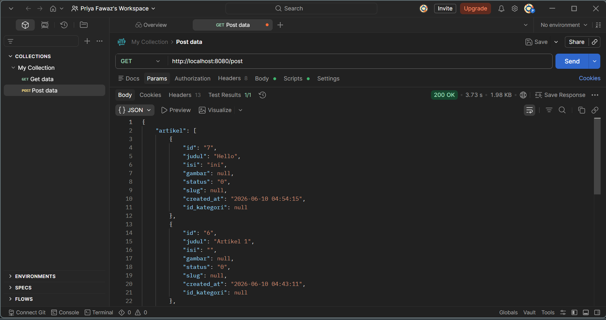

# Praktikum 10: API
## Mengunduh aplikasi REST Client, Postman. Postman – (https://www.postman.com/downloads/)
## Membuat REST Controller, Masuklah ke direktori app\Controllers dan buatlah file baru bernama Post.php
```php
<?php
namespace App\Controllers;

use CodeIgniter\RESTful\ResourceController;
use CodeIgniter\API\ResponseTrait;
use App\Models\ArtikelModel;

class Post extends ResourceController
{
    use ResponseTrait;

    // Menampilkan semua data
    public function index()
    {
        $model = new ArtikelModel();
        $data['artikel'] = $model->orderBy('id', 'DESC')->findAll();
        return $this->respond($data);
    }

    // Menambahkan data baru
    public function create()
    {
        $model = new ArtikelModel();
        $data = [
            'judul' => $this->request->getVar('judul'),
            'isi'   => $this->request->getVar('isi')
        ];
        $model->insert($data);
        
        $response = [
            'status'   => 201,
            'error'    => null,
            'messages' => [
                'success' => 'Data artikel berhasil ditambahkan.'
            ]
        ];
        return $this->respondCreated($response);
    }

    // Menampilkan data spesifik berdasarkan ID
    public function show($id = null)
    {
        $model = new ArtikelModel();
        $data = $model->where('id', $id)->first();
        if ($data) {
            return $this->respond($data);
        } else {
            return $this->failNotFound('Data tidak ditemukan.');
        }
    }

    // Mengubah data
    public function update($id = null)
    {
        $model = new ArtikelModel();
        $data = [
            'judul' => $this->request->getVar('judul'),
            'isi'   => $this->request->getVar('isi')
        ];
        $model->update($id, $data);
        
        $response = [
            'status'   => 200,
            'error'    => null,
            'messages' => [
                'success' => 'Data artikel berhasil diubah.'
            ]
        ];
        return $this->respond($response);
    }

    // Menghapus data
    public function delete($id = null)
    {
        $model = new ArtikelModel();
        $data = $model->where('id', $id)->first();
        
        if ($data) {
            $model->delete($id);
            $response = [
                'status'   => 200,
                'error'    => null,
                'messages' => [
                    'success' => 'Data artikel berhasil dihapus.'
                ]
            ];
            return $this->respondDeleted($response);
        } else {
            return $this->failNotFound('Data tidak ditemukan.');
        }
    }
}
```

## Membuat Routing REST API,  direktori app/Config dan bukalah file Routes.php
```php
$routes->resource('post');
```

## Testing REST API CodeIgniter, Buka aplikasi postman dan pilih create new → HTTP Request
### Menampilkan Semua Data
* Pilih method GET dan masukkan URL berikut:
* http://localhost:8080/post Lalu, klik Send. Jika hasil test menampilkan semua data artikel dari database, maka pengujian berhasil.


### Menampilkan Data Spesifik
* Masih menggunakan method GET, hanya perlu menambahkan ID artikel di belakang URL seperti ini:
* http://localhost:8080/post/3 Selanjutnya, klik Send. Request tersebut akan menampilkan data artikel yang memiliki ID nomor 3 di database.

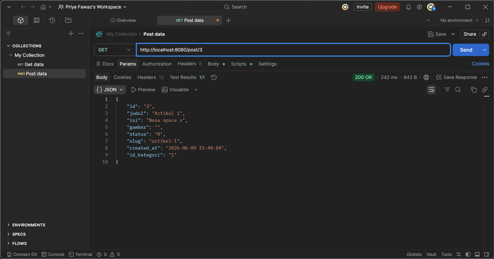

### Mengubah Data
* Untuk mengubah data, silakan ganti method menjadi PUT. Kemudian, masukkan URL artikel yang ingin diubah. Misalnya, ingin mengubah data artikel dengan ID nomor 3, maka masukkan URL berikut:
* http://localhost:8080/post/2, Selanjutnya, pilih tab Body. Kemudian, pilih x-www-form-uriencoded. Masukkan nama atribut tabel pada kolom KEY dan nilai data yang baru pada kolom VALUE. Kalau sudah, klik Send.

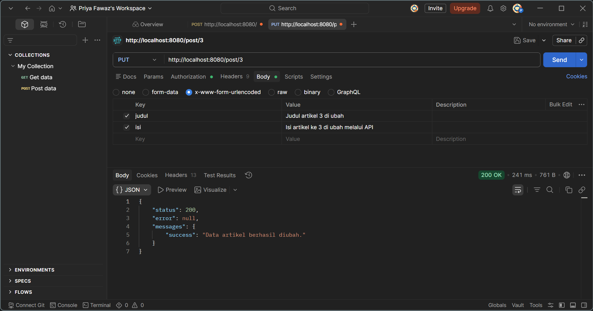

### Menambahkan Data
* Anda perlu menggunakan method POST untuk menambahkan data baru ke database. Kemudian, masukkan URL berikut:
* http://localhost:8080/post Pilih tab Body, lalu pilih x-www-form-uriencoded. Masukkan atribut tabel pada kolom KEY dan nilai data baru di kolom VALUE. Jangan lupa, klik Send.

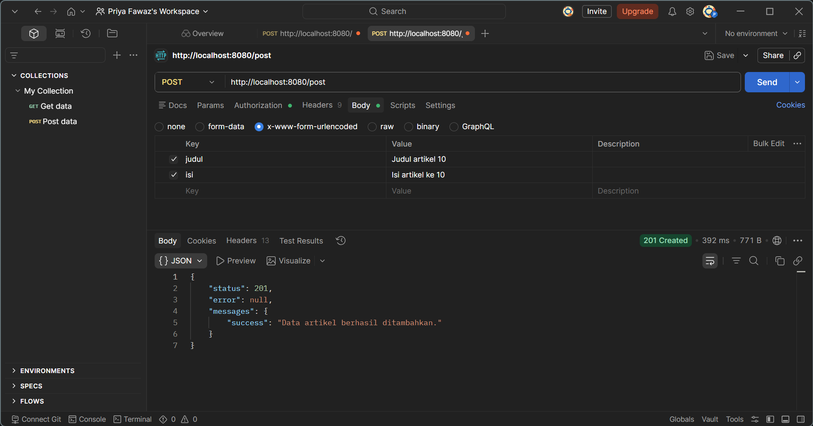

### Menghapus Data
* Pilih method DELETE untuk menghapus data. Lalu, masukkan URL spesifik data mana yang ingin di hapus. Misalnya, ingin menghapus data nomor 3, maka URL-nya seperti ini:
* http://localhost:8080/post/3 Langsung saja klik Send, maka akan mendapatkan pesan bahwa data telah berhasil dihapus dari database.

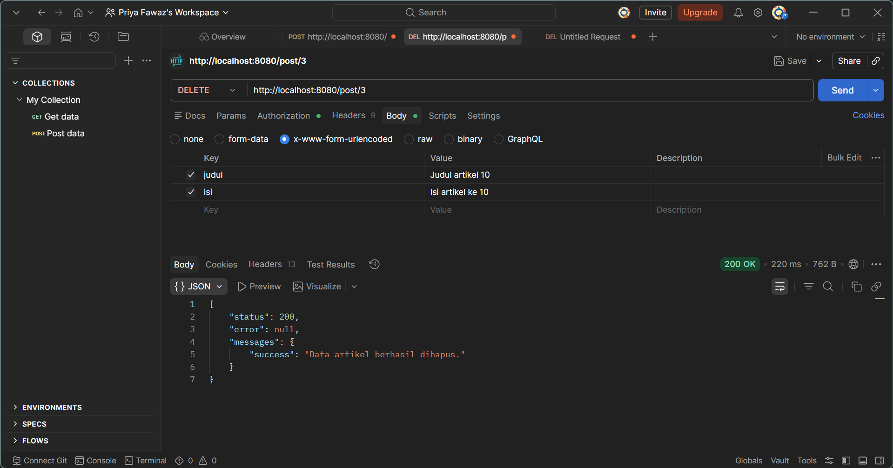